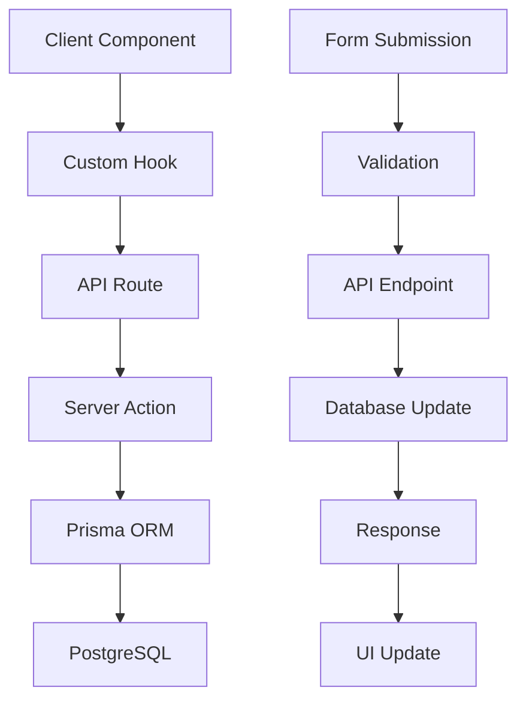
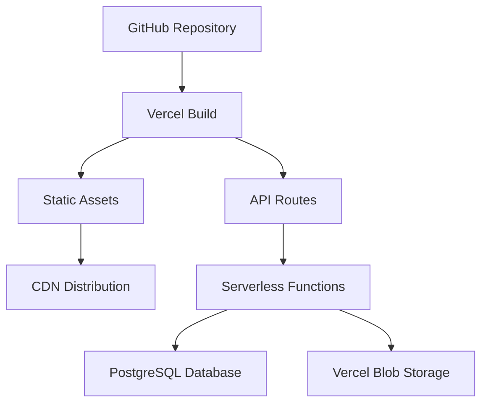

# Architecture Overview

This document provides a high-level overview of the MedBookings application architecture, explaining how all the documented components work together to create a comprehensive medical appointment booking system.

## Table of Contents

- [System Overview](#system-overview)
- [Technology Stack](#technology-stack)
- [Application Structure](#application-structure)
- [Data Flow](#data-flow)
- [Authentication & Authorization](#authentication--authorization)
- [Feature Architecture](#feature-architecture)
- [API Design](#api-design)
- [State Management](#state-management)
- [File Organization](#file-organization)
- [Deployment Architecture](#deployment-architecture)

---

## System Overview

MedBookings is a comprehensive medical appointment booking system built with modern web technologies. It serves three main user types:

1. **Patients/Users**: Search for healthcare providers and book appointments
2. **Healthcare Providers**: Manage their practice, availability, and patient bookings
3. **Organizations**: Manage multiple providers and coordinate healthcare services
4. **Administrators**: Oversee the platform and manage approvals

### Core Features

- **Provider Management**: Registration, verification, and profile management
- **Appointment Booking**: Real-time availability and booking system
- **Organization Management**: Multi-provider healthcare organizations
- **Calendar Integration**: Google Calendar and other calendar services
- **File Management**: Document upload and verification system
- **Communication**: Notifications and messaging system
- **Admin Panel**: Platform administration and monitoring

---

## Technology Stack

### Frontend
- **Next.js 14**: React framework with App Router
- **TypeScript**: Type-safe JavaScript development
- **Tailwind CSS**: Utility-first CSS framework
- **Radix UI**: Accessible component primitives
- **React Hook Form**: Form management and validation
- **TanStack Query**: Server state management
- **Zod**: Schema validation

### Backend
- **Next.js API Routes**: Serverless API endpoints
- **Prisma**: Database ORM and schema management
- **PostgreSQL**: Primary database
- **NextAuth.js**: Authentication and session management

### Infrastructure
- **Vercel**: Hosting and deployment platform
- **Vercel Blob**: File storage
- **Google OAuth**: Authentication provider
- **Google Maps API**: Location services
- **Twilio**: SMS notifications (configured)
- **SendGrid**: Email notifications (configured)

---

## Application Structure

### Directory Structure

```
src/
├── app/                    # Next.js App Router pages
│   ├── (dashboard)/       # Authenticated user pages
│   ├── (general)/         # Public pages
│   └── api/               # API routes
├── components/            # Reusable UI components
│   ├── ui/               # Base UI components
│   └── [feature]/        # Feature-specific components
├── features/             # Feature-based modules
│   ├── auth/             # Authentication
│   ├── providers/        # Healthcare providers
│   ├── organizations/    # Healthcare organizations
│   ├── calendar/         # Booking and availability
│   ├── admin/            # Administration
│   └── communications/   # Notifications
├── hooks/                # Custom React hooks
├── lib/                  # Utility libraries
├── types/                # TypeScript definitions
└── utils/                # Helper utilities
```

### Feature-Based Architecture

Each feature module follows a consistent structure:

```
feature/
├── components/           # UI components
├── hooks/               # Feature-specific hooks
├── lib/                 # Business logic and actions
├── types/               # Type definitions
└── index.ts             # Public exports
```

---

## Data Flow

### Client-Server Interaction



### State Management Flow

1. **Server State**: Managed by TanStack Query
   - API data caching
   - Background refetching
   - Optimistic updates

2. **Client State**: React state and hooks
   - UI interactions
   - Form state
   - Local preferences

3. **Authentication State**: NextAuth.js sessions
   - User authentication
   - Role-based access
   - Session persistence

### Form Data Flow

1. **Form Component** → React Hook Form
2. **Validation** → Zod schemas
3. **Submission** → API route
4. **Processing** → Server actions
5. **Database** → Prisma operations
6. **Response** → UI updates

---

## Authentication & Authorization

### Authentication Flow

```typescript
// NextAuth.js configuration
providers: [GoogleProvider]
adapter: PrismaAdapter
callbacks: {
  jwt: // Token enrichment
  session: // Session customization
}
```

### Authorization Levels

1. **Public Routes**: No authentication required
2. **User Routes**: Basic authentication
3. **Provider Routes**: Provider-specific access
4. **Organization Routes**: Organization member access
5. **Admin Routes**: Admin role required

### Role-Based Access Control

```typescript
enum UserRole {
  USER = 'USER',
  ADMIN = 'ADMIN',
  SUPER_ADMIN = 'SUPER_ADMIN'
}

// Authorization check
async function checkRole(allowedRoles: UserRole[]) {
  const user = await getCurrentUser();
  if (!allowedRoles.includes(user.role)) {
    throw new Error('Not authorized');
  }
}
```

---

## Feature Architecture

### Provider Management

**Components:**
- Registration forms and wizards
- Profile management interfaces
- Service configuration
- Availability management

**API Endpoints:**
- `POST /api/providers` - Provider registration
- `GET /api/providers/[id]` - Provider details
- `PUT /api/providers/[id]` - Profile updates

**Database Models:**
- ServiceProvider
- ServiceProviderType
- RequirementSubmission
- Service configurations

### Booking System

**Components:**
- Provider search interface
- Calendar availability display
- Booking forms
- Confirmation flows

**API Endpoints:**
- `GET /api/calendar` - Availability slots
- `POST /api/bookings` - Create booking
- `PUT /api/bookings/[id]` - Update booking

**Database Models:**
- Availability
- CalculatedAvailabilitySlot
- Booking
- RecurrencePattern

### Organization Management

**Components:**
- Organization registration
- Provider network management
- Invitation system
- Location management

**API Endpoints:**
- `POST /api/organizations` - Create organization
- `GET /api/organizations/[id]` - Organization details
- `POST /api/invitations` - Send invitations

**Database Models:**
- Organization
- OrganizationProviderConnection
- ProviderInvitation
- Location

---

## API Design

### RESTful Conventions

- `GET` - Retrieve data
- `POST` - Create new resources
- `PUT` - Update existing resources
- `DELETE` - Remove resources

### Response Format

```typescript
// Success response
{
  success: true,
  data: T,
  message?: string
}

// Error response
{
  success: false,
  error: string,
  details?: any
}
```

### Authentication

- Session-based authentication
- HTTP-only cookies
- Server-side session validation
- Role-based endpoint protection

### Error Handling

- Consistent error responses
- Appropriate HTTP status codes
- Detailed error messages for development
- Sanitized errors for production

---

## State Management

### Server State (TanStack Query)

```typescript
// Query configuration
const providerQuery = useQuery({
  queryKey: ['provider', id],
  queryFn: () => fetchProvider(id),
  staleTime: 5 * 60 * 1000, // 5 minutes
});

// Mutation with optimistic updates
const updateProvider = useMutation({
  mutationFn: updateProviderAPI,
  onMutate: async (newData) => {
    // Optimistic update
    await queryClient.cancelQueries(['provider', id]);
    const previousData = queryClient.getQueryData(['provider', id]);
    queryClient.setQueryData(['provider', id], newData);
    return { previousData };
  },
});
```

### Client State (React Hooks)

```typescript
// Custom hooks for complex state
const useProviderForm = () => {
  const [formData, setFormData] = useState(initialData);
  const [errors, setErrors] = useState({});
  
  // Form logic and validation
  return { formData, errors, handleSubmit, reset };
};
```

### Global State

- Authentication: NextAuth.js sessions
- Theme: Next-themes for dark/light mode
- Toasts: Custom toast system
- Navigation: Custom navigation hook

---

## File Organization

### Component Structure

```typescript
// Component file structure
ComponentName/
├── ComponentName.tsx       # Main component
├── ComponentName.test.tsx  # Tests
├── ComponentName.types.ts  # Type definitions
├── ComponentName.styles.ts # Styled components (if needed)
└── index.ts               # Re-exports
```

### Import Conventions

```typescript
// External libraries
import React from 'react';
import { useQuery } from '@tanstack/react-query';

// Internal utilities
import { cn } from '@/lib/utils';
import { Button } from '@/components/ui/button';

// Feature imports
import { useProviderData } from '@/features/providers/hooks';

// Types
import type { Provider } from '@/types/provider';
```

### Barrel Exports

```typescript
// Feature index.ts
export { ProviderForm } from './components/provider-form';
export { useProviderData } from './hooks/use-provider-data';
export type { ProviderFormData } from './types';
```

---

## Deployment Architecture

### Vercel Platform



### Environment Configuration

```typescript
// Development
- Local PostgreSQL
- Local file storage
- Development OAuth apps

// Production
- Vercel PostgreSQL
- Vercel Blob storage
- Production OAuth apps
- Environment-specific configs
```

### Database Architecture

```sql
-- Core entities
User (authentication)
ServiceProvider (healthcare providers)
Organization (healthcare organizations)
Service (medical services)

-- Booking system
Availability (provider availability)
CalculatedAvailabilitySlot (computed slots)
Booking (appointments)

-- Relationship management
OrganizationProviderConnection
ProviderInvitation
RequirementSubmission
```

### File Storage

- **Vercel Blob**: Profile images, documents, certificates
- **Organized Structure**: `/{directory}/{uuid}-|-{purpose}-|-{timestamp}-|-{filename}`
- **Access Control**: Public URLs with secure naming
- **File Types**: PDF, JPG, PNG with validation

---

## Performance Considerations

### Frontend Optimization

- **Code Splitting**: Next.js automatic splitting
- **Image Optimization**: Next.js Image component
- **Bundle Analysis**: Regular bundle size monitoring
- **Lazy Loading**: Component and route-based

### Backend Optimization

- **Database Indexing**: Optimized Prisma queries
- **Caching**: TanStack Query for client-side caching
- **API Response Time**: Optimized database queries
- **Serverless Functions**: Efficient cold start handling

### Development Workflow

- **Type Safety**: TypeScript throughout
- **Code Quality**: ESLint and Prettier
- **Testing**: Unit and integration tests
- **Documentation**: Comprehensive API docs

---

## Security Considerations

### Authentication Security

- **OAuth 2.0**: Google authentication
- **Session Management**: Secure HTTP-only cookies
- **CSRF Protection**: Built-in Next.js protection
- **Input Validation**: Zod schema validation

### Data Protection

- **SQL Injection**: Prisma ORM protection
- **XSS Prevention**: React built-in protection
- **File Upload Security**: Type and size validation
- **Access Control**: Role-based permissions

### API Security

- **Rate Limiting**: Configured for all endpoints
- **Input Sanitization**: Server-side validation
- **Error Handling**: No sensitive data exposure
- **Audit Logging**: Activity tracking (configurable)

---

## Monitoring & Observability

### Error Tracking

- **Client Errors**: React Error Boundaries
- **Server Errors**: Centralized error handling
- **API Monitoring**: Response time tracking
- **Database Performance**: Query optimization

### Analytics

- **User Behavior**: Privacy-compliant tracking
- **Performance Metrics**: Core Web Vitals
- **Business Metrics**: Booking success rates
- **System Health**: Uptime monitoring

---

## Development Guidelines

### Code Standards

- **TypeScript**: Strict mode enabled
- **Naming Conventions**: Consistent across codebase
- **Component Patterns**: Established conventions
- **Error Handling**: Consistent error boundaries

### Testing Strategy

- **Unit Tests**: Component and utility testing
- **Integration Tests**: API endpoint testing
- **E2E Tests**: Critical user flow testing
- **Type Testing**: TypeScript compilation

### Documentation

- **Code Comments**: JSDoc for complex functions
- **API Documentation**: Comprehensive endpoint docs
- **Component Documentation**: Props and usage
- **Architecture Documentation**: System overview

This architecture provides a scalable, maintainable foundation for the MedBookings platform, with clear separation of concerns, robust error handling, and comprehensive documentation for all system components.
