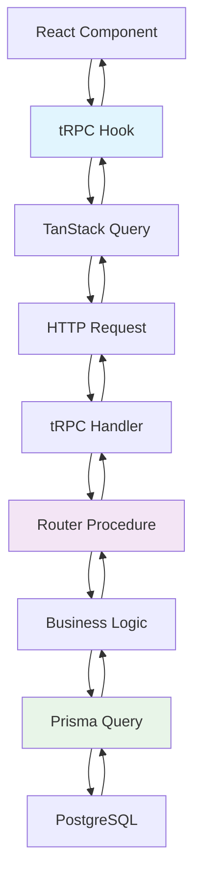

# 🌐 tRPC Architecture

This document explains how MedBookings uses tRPC to create a type-safe, full-stack TypeScript API layer that connects the frontend directly to the backend with complete type inference.

## 📖 What You'll Learn

- **tRPC Fundamentals**: What tRPC is and why it's used
- **API Architecture**: How the API layer is structured
- **Procedure Types**: Public, protected, and admin procedures
- **Router Organization**: How API endpoints are organized
- **Type Safety**: End-to-end type inference
- **Error Handling**: Consistent error management
- **Integration Patterns**: How frontend components use tRPC

## 🎯 What is tRPC?

**tRPC** (TypeScript Remote Procedure Call) creates type-safe APIs without code generation by leveraging TypeScript's type inference across the full stack.

### Key Benefits

1. **End-to-End Type Safety**: Types flow from database → API → frontend automatically
2. **No Code Generation**: Types are inferred at compile-time
3. **Excellent DX**: IntelliSense, autocomplete, and type checking throughout
4. **Runtime Safety**: Automatic request/response validation
5. **Performance**: Automatic caching via TanStack Query integration

### tRPC vs Traditional REST

```typescript
// ❌ Traditional REST - No type safety
// Backend
app.get('/api/providers/:id', (req, res) => {
  const id = req.params.id; // string (could be anything)
  const provider = await getProvider(id);
  res.json(provider); // any
});

// Frontend  
const response = await fetch('/api/providers/123');
const provider = await response.json(); // any - no type safety

// ✅ tRPC - Full type safety
// Backend
export const providerRouter = createTRPCRouter({
  getById: publicProcedure
    .input(z.object({ id: z.string() })) // Input validation
    .query(async ({ input }) => {
      return await getProvider(input.id); // Type-safe
    }),
});

// Frontend
const { data: provider } = api.providers.getById.useQuery({ id: '123' });
// provider is fully typed! No manual type assertions needed
```

## 🏗️ tRPC Architecture Overview



## 📂 API Structure

### Root Router Configuration

```typescript
// src/server/api/root.ts - Main API router
import { createTRPCRouter } from '@/server/trpc';
import { adminRouter } from './routers/admin';
import { providersRouter } from './routers/providers';
import { organizationsRouter } from './routers/organizations';
import { calendarRouter } from './routers/calendar';

export const appRouter = createTRPCRouter({
  admin: adminRouter,           // /api/trpc/admin.*
  providers: providersRouter,   // /api/trpc/providers.*
  organizations: organizationsRouter, // /api/trpc/organizations.*
  calendar: calendarRouter,     // /api/trpc/calendar.*
});

// Export router type for frontend
export type AppRouter = typeof appRouter;
```

### Router Organization

```
src/server/api/routers/
├── admin.ts              # Admin management procedures
├── providers.ts          # Provider management procedures  
├── organizations.ts      # Organization management procedures
├── calendar.ts           # Booking and availability procedures
├── communications.ts     # Notifications and messaging
├── profile.ts            # User profile procedures
└── debug.ts              # Development utilities
```

## 🔧 tRPC Configuration

### Server Setup

```typescript
// src/server/trpc.ts - tRPC server configuration
import { initTRPC, TRPCError } from '@trpc/server';
import { type Session } from 'next-auth';
import superjson from 'superjson';
import { ZodError } from 'zod';
import { getCurrentUser } from '@/lib/auth';
import { prisma } from '@/lib/prisma';

// Context type definition
type CreateContextOptions = {
  session: Session | null;
};

// Create tRPC context (runs on every request)
export const createTRPCContext = async (opts: CreateNextContextOptions) => {
  const user = await getCurrentUser();
  
  return {
    session: user ? { user, expires: '' } : null,
    prisma, // Database access
  };
};

// Initialize tRPC with configuration
const t = initTRPC.context<typeof createTRPCContext>().create({
  transformer: superjson, // Serialize Date, BigInt, etc.
  errorFormatter({ shape, error }) {
    return {
      ...shape,
      data: {
        ...shape.data,
        // Include Zod validation errors
        zodError: error.cause instanceof ZodError ? error.cause.flatten() : null,
      },
    };
  },
});

// Export router and procedure builders
export const createTRPCRouter = t.router;
export const publicProcedure = t.procedure;
```

### Client Setup

```typescript
// src/utils/api.ts - Frontend tRPC client
import { createTRPCReact } from '@trpc/react-query';
import { type inferRouterInputs, type inferRouterOutputs } from '@trpc/server';
import { type AppRouter } from '@/server/api/root';

// Create typed React hooks
export const api = createTRPCReact<AppRouter>();

// Type helpers for extracting input/output types
export type RouterInputs = inferRouterInputs<AppRouter>;
export type RouterOutputs = inferRouterOutputs<AppRouter>;

// Usage examples:
// type ProviderInput = RouterInputs['providers']['create'];
// type ProviderOutput = RouterOutputs['providers']['getById'];
```

## 🔒 Procedure Types and Middleware

### Authentication Middleware

```typescript
// Authentication middleware
const enforceUserIsAuthed = t.middleware(({ ctx, next }) => {
  if (!ctx.session?.user) {
    throw new TRPCError({ code: 'UNAUTHORIZED' });
  }
  
  return next({
    ctx: {
      ...ctx,
      session: { ...ctx.session, user: ctx.session.user }, // Non-null user
    },
  });
});

// Role-based middleware
const enforceUserHasRole = (allowedRoles: string[]) => {
  return t.middleware(({ ctx, next }) => {
    if (!ctx.session?.user) {
      throw new TRPCError({ code: 'UNAUTHORIZED' });
    }

    const user = ctx.session.user as any;
    if (!allowedRoles.includes(user.role)) {
      throw new TRPCError({
        code: 'FORBIDDEN',
        message: 'You do not have permission to perform this action',
      });
    }

    return next({ ctx });
  });
};
```

### Procedure Types

```typescript
// 1. Public procedures - No authentication required
export const publicProcedure = t.procedure;

// 2. Protected procedures - Authentication required
export const protectedProcedure = t.procedure.use(enforceUserIsAuthed);

// 3. Admin procedures - Admin/Super Admin roles required
export const adminProcedure = t.procedure.use(
  enforceUserHasRole(['ADMIN', 'SUPER_ADMIN'])
);

// 4. Super Admin procedures - Super Admin role only
export const superAdminProcedure = t.procedure.use(
  enforceUserHasRole(['SUPER_ADMIN'])
);
```

## 📋 Router Implementation Patterns

### Standard Router Structure

```typescript
// src/server/api/routers/providers.ts
import { z } from 'zod';
import { createTRPCRouter, publicProcedure, protectedProcedure, adminProcedure } from '@/server/trpc';
import { TRPCError } from '@trpc/server';

export const providersRouter = createTRPCRouter({
  // Queries (Read Operations)
  getAll: publicProcedure
    .input(z.object({
      limit: z.number().min(1).max(100).default(10),
      cursor: z.string().optional(),
      search: z.string().optional(),
    }))
    .query(async ({ ctx, input }) => {
      const providers = await ctx.prisma.provider.findMany({
        where: {
          ...(input.search && {
            OR: [
              { name: { contains: input.search, mode: 'insensitive' } },
              { user: { name: { contains: input.search, mode: 'insensitive' } } }
            ]
          })
        },
        include: {
          user: { select: { name: true, email: true, image: true } },
          services: { select: { id: true, name: true } }
        },
        take: input.limit + 1,
        ...(input.cursor && {
          cursor: { id: input.cursor },
          skip: 1,
        }),
        orderBy: { createdAt: 'desc' },
      });

      let nextCursor: typeof input.cursor | undefined = undefined;
      if (providers.length > input.limit) {
        const nextItem = providers.pop();
        nextCursor = nextItem!.id;
      }

      return {
        providers,
        nextCursor,
      };
    }),

  getById: publicProcedure
    .input(z.object({ id: z.string() }))
    .query(async ({ ctx, input }) => {
      const provider = await ctx.prisma.provider.findUnique({
        where: { id: input.id },
        include: {
          user: true,
          services: true,
          typeAssignments: {
            include: { providerType: true }
          }
        },
      });

      if (!provider) {
        throw new TRPCError({
          code: 'NOT_FOUND',
          message: 'Provider not found',
        });
      }

      return provider;
    }),

  // Mutations (Write Operations)
  create: protectedProcedure
    .input(z.object({
      name: z.string().min(1).max(100),
      bio: z.string().max(1000).optional(),
      languages: z.array(z.nativeEnum(Languages)),
      website: z.string().url().optional(),
      serviceIds: z.array(z.string().cuid()),
    }))
    .mutation(async ({ ctx, input }) => {
      const { serviceIds, ...providerData } = input;

      // Business logic - check for existing provider
      const existingProvider = await ctx.prisma.provider.findUnique({
        where: { userId: ctx.session.user.id }
      });

      if (existingProvider) {
        throw new TRPCError({
          code: 'CONFLICT',
          message: 'User already has a provider profile',
        });
      }

      // Create provider with transaction
      const provider = await ctx.prisma.$transaction(async (tx) => {
        const newProvider = await tx.provider.create({
          data: {
            ...providerData,
            userId: ctx.session.user.id,
            status: 'PENDING_APPROVAL',
            services: {
              connect: serviceIds.map(id => ({ id }))
            }
          },
          include: {
            user: true,
            services: true,
          }
        });

        // Business logic - send notification
        await sendProviderCreatedNotification(newProvider.id);

        return newProvider;
      });

      return provider;
    }),

  // Admin procedures
  approve: adminProcedure
    .input(z.object({
      id: z.string(),
      approved: z.boolean(),
      rejectionReason: z.string().optional(),
    }))
    .mutation(async ({ ctx, input }) => {
      const { id, approved, rejectionReason } = input;

      const provider = await ctx.prisma.provider.update({
        where: { id },
        data: {
          status: approved ? 'APPROVED' : 'REJECTED',
          approvedAt: approved ? new Date() : null,
          approvedById: approved ? ctx.session.user.id : null,
          rejectedAt: approved ? null : new Date(),
          rejectionReason: approved ? null : rejectionReason,
        },
        include: {
          user: { select: { name: true, email: true } }
        }
      });

      // Send notification
      if (approved) {
        await sendProviderApprovedNotification(provider.id);
      } else {
        await sendProviderRejectedNotification(provider.id, rejectionReason);
      }

      return provider;
    }),
});
```

### Input Validation Patterns

```typescript
// Complex validation schemas
const createAvailabilitySchema = z.object({
  providerId: z.string().cuid(),
  startTime: z.date(),
  endTime: z.date(),
  serviceConfigs: z.array(z.object({
    serviceId: z.string().cuid(),
    duration: z.number().min(15).max(480), // 15 minutes to 8 hours
    price: z.number().positive(),
    isOnline: z.boolean(),
    locationId: z.string().cuid().optional(),
  })),
  recurrence: z.object({
    pattern: z.enum(['daily', 'weekly', 'monthly']),
    interval: z.number().min(1).max(12),
    endDate: z.date().optional(),
    daysOfWeek: z.array(z.number().min(0).max(6)).optional(), // 0 = Sunday
  }).optional(),
}).refine((data) => {
  // Custom validation - end time must be after start time
  return data.endTime > data.startTime;
}, {
  message: "End time must be after start time",
  path: ["endTime"]
});

// Usage in procedure
createAvailability: protectedProcedure
  .input(createAvailabilitySchema)
  .mutation(async ({ ctx, input }) => {
    // Input is fully typed and validated
    // ... implementation
  });
```

## 🎣 Frontend Integration

### Basic Hook Usage

```typescript
// Component using tRPC hooks
function ProvidersPage() {
  // Query hook - automatic caching, loading states, error handling
  const {
    data: providers,
    isLoading,
    isError,
    error,
    fetchNextPage,
    hasNextPage,
  } = api.providers.getAll.useInfiniteQuery(
    { limit: 10 },
    {
      getNextPageParam: (lastPage) => lastPage.nextCursor,
      staleTime: 5 * 60 * 1000, // 5 minutes
    }
  );

  if (isLoading) return <LoadingSkeleton />;
  if (isError) return <ErrorMessage error={error} />;

  return (
    <div>
      {providers?.pages.map((page) =>
        page.providers.map((provider) => (
          <ProviderCard key={provider.id} provider={provider} />
        ))
      )}
      {hasNextPage && (
        <button onClick={() => fetchNextPage()}>
          Load More
        </button>
      )}
    </div>
  );
}
```

### Mutation Hook Usage

```typescript
function CreateProviderForm() {
  const utils = api.useContext(); // Access to query client utilities
  
  const createProvider = api.providers.create.useMutation({
    // Optimistic update
    onMutate: async (variables) => {
      await utils.providers.getAll.cancel();
      
      const previousProviders = utils.providers.getAll.getInfiniteData();
      
      // Add optimistic provider to cache
      utils.providers.getAll.setInfiniteData({}, (old) => {
        if (!old) return { pages: [], pageParams: [] };
        
        const newProvider = {
          id: 'temp-id',
          ...variables,
          createdAt: new Date(),
          status: 'PENDING_APPROVAL' as const,
        };
        
        return {
          ...old,
          pages: [
            {
              providers: [newProvider, ...old.pages[0]!.providers],
              nextCursor: old.pages[0]!.nextCursor,
            },
            ...old.pages.slice(1),
          ],
        };
      });
      
      return { previousProviders };
    },
    
    // Handle success
    onSuccess: (data) => {
      // Invalidate and refetch
      utils.providers.getAll.invalidate();
      toast.success('Provider created successfully!');
    },
    
    // Handle error - rollback optimistic update
    onError: (error, variables, context) => {
      if (context?.previousProviders) {
        utils.providers.getAll.setInfiniteData({}, context.previousProviders);
      }
      toast.error('Failed to create provider');
    },
  });

  const handleSubmit = (data: CreateProviderData) => {
    createProvider.mutate(data);
  };

  return (
    <form onSubmit={handleSubmit}>
      {/* Form fields */}
      <button 
        type="submit" 
        disabled={createProvider.isLoading}
      >
        {createProvider.isLoading ? 'Creating...' : 'Create Provider'}
      </button>
    </form>
  );
}
```

### Advanced Cache Management

```typescript
function useAdvancedProviderOperations() {
  const utils = api.useContext();

  const invalidateProviders = async () => {
    // Invalidate all provider queries
    await utils.providers.invalidate();
  };

  const invalidateSpecificProvider = async (id: string) => {
    // Invalidate specific provider
    await utils.providers.getById.invalidate({ id });
  };

  const prefetchProvider = async (id: string) => {
    // Prefetch provider data
    await utils.providers.getById.prefetch({ id });
  };

  const setProviderData = (id: string, provider: Provider) => {
    // Manually set cache data
    utils.providers.getById.setData({ id }, provider);
  };

  const removeProvider = (id: string) => {
    // Remove from list cache
    utils.providers.getAll.setInfiniteData({}, (old) => {
      if (!old) return old;
      
      return {
        ...old,
        pages: old.pages.map((page) => ({
          ...page,
          providers: page.providers.filter((p) => p.id !== id),
        })),
      };
    });
    
    // Remove individual cache entry
    utils.providers.getById.setData({ id }, undefined);
  };

  return {
    invalidateProviders,
    invalidateSpecificProvider,
    prefetchProvider,
    setProviderData,
    removeProvider,
  };
}
```

## ❌ Error Handling

### Server-Side Error Types

```typescript
// Standard tRPC error codes
const errorCodes = [
  'PARSE_ERROR',          // Invalid JSON
  'BAD_REQUEST',          // Invalid input
  'INTERNAL_SERVER_ERROR', // Server error
  'UNAUTHORIZED',         // Not authenticated
  'FORBIDDEN',           // Not authorized
  'NOT_FOUND',           // Resource not found
  'METHOD_NOT_SUPPORTED', // Wrong HTTP method
  'TIMEOUT',             // Request timeout
  'CONFLICT',            // Resource conflict
  'PRECONDITION_FAILED', // Precondition not met
  'PAYLOAD_TOO_LARGE',   // Request too large
  'UNPROCESSABLE_CONTENT', // Validation error
  'TOO_MANY_REQUESTS',   // Rate limited
  'CLIENT_CLOSED_REQUEST', // Client cancelled
] as const;

// Custom error helper
function createTRPCError(code: keyof typeof errorCodes, message: string, cause?: Error) {
  return new TRPCError({
    code,
    message,
    cause,
  });
}

// Usage in procedures
getProvider: publicProcedure
  .input(z.object({ id: z.string() }))
  .query(async ({ ctx, input }) => {
    try {
      const provider = await ctx.prisma.provider.findUnique({
        where: { id: input.id }
      });
      
      if (!provider) {
        throw createTRPCError('NOT_FOUND', 'Provider not found');
      }
      
      return provider;
    } catch (error) {
      if (error instanceof TRPCError) throw error;
      
      // Log unexpected errors
      console.error('Unexpected error fetching provider:', error);
      throw createTRPCError('INTERNAL_SERVER_ERROR', 'An unexpected error occurred');
    }
  });
```

### Client-Side Error Handling

```typescript
function ProviderDetail({ id }: { id: string }) {
  const {
    data: provider,
    isLoading,
    error,
    refetch,
  } = api.providers.getById.useQuery({ id });

  // Handle different error types
  if (error) {
    switch (error.data?.code) {
      case 'NOT_FOUND':
        return <NotFoundError message="Provider not found" />;
      case 'UNAUTHORIZED':
        return <UnauthorizedError />;
      case 'FORBIDDEN':
        return <ForbiddenError />;
      default:
        return (
          <ErrorBoundary>
            <GenericError error={error} onRetry={refetch} />
          </ErrorBoundary>
        );
    }
  }

  if (isLoading) return <LoadingSkeleton />;
  if (!provider) return <EmptyState />;

  return <ProviderDetailView provider={provider} />;
}

// Generic error component
function GenericError({ error, onRetry }: { error: any, onRetry: () => void }) {
  return (
    <div className="text-center py-8">
      <h2 className="text-lg font-semibold text-red-600">
        Something went wrong
      </h2>
      <p className="text-gray-600 mt-2">
        {error.message || 'An unexpected error occurred'}
      </p>
      <button 
        onClick={onRetry}
        className="mt-4 px-4 py-2 bg-blue-600 text-white rounded"
      >
        Try Again
      </button>
    </div>
  );
}
```

## 🎯 Type Safety Patterns

### Type Extraction Examples

```typescript
// Extract types from router outputs
import { type RouterOutputs } from '@/utils/api';

// Single provider type
type Provider = RouterOutputs['providers']['getById'];

// Provider list type  
type ProviderList = RouterOutputs['providers']['getAll'];
type SingleProvider = ProviderList['providers'][number];

// Nested type extraction
type ProviderUser = NonNullable<Provider>['user'];
type ProviderServices = NonNullable<Provider>['services'];

// Input types
import { type RouterInputs } from '@/utils/api';
type CreateProviderInput = RouterInputs['providers']['create'];
type UpdateProviderInput = RouterInputs['providers']['update'];
```

### Component Type Patterns

```typescript
// Type-safe component props
interface ProviderCardProps {
  provider: RouterOutputs['providers']['getAll']['providers'][number];
  onEdit?: (provider: Provider) => void;
  onDelete?: (id: string) => void;
}

function ProviderCard({ provider, onEdit, onDelete }: ProviderCardProps) {
  // provider is fully typed here
  return (
    <div>
      <h3>{provider.name}</h3>
      <p>{provider.user.name}</p>
      {onEdit && (
        <button onClick={() => onEdit(provider)}>
          Edit
        </button>
      )}
    </div>
  );
}
```

## 🎯 Best Practices Summary

### Router Organization
1. **Feature-Based Routers**: One router per business domain
2. **Consistent Naming**: `get`, `getAll`, `create`, `update`, `delete`
3. **Input Validation**: Always validate inputs with Zod
4. **Error Handling**: Use appropriate tRPC error codes

### Procedure Design
1. **Single Responsibility**: Each procedure does one thing well
2. **Proper Authorization**: Use appropriate procedure types
3. **Input Validation**: Comprehensive Zod schemas
4. **Error Messages**: Clear, actionable error messages

### Frontend Integration
1. **Hook Composition**: Combine multiple hooks cleanly
2. **Cache Management**: Strategic invalidation and prefetching
3. **Optimistic Updates**: For better UX
4. **Error Boundaries**: Graceful error handling

### Type Safety
1. **Extract Don't Define**: Use RouterOutputs types
2. **Component Props**: Type props from router outputs
3. **Input Types**: Use RouterInputs for form types
4. **Avoid Any**: Maintain type safety throughout

## 🔗 Related Documentation

- [Core Architecture Overview](../core/architecture-overview.md) - System design patterns
- [Data Flow Patterns](../core/data-flow-patterns.md) - Type system and data management
- [Component Patterns](../components/component-patterns.md) - UI integration patterns
- [Feature Module Pattern](../features/feature-module-pattern.md) - Feature organization

---

*This tRPC architecture provides end-to-end type safety, excellent developer experience, and maintainable API design patterns that scale with the MedBookings platform.*