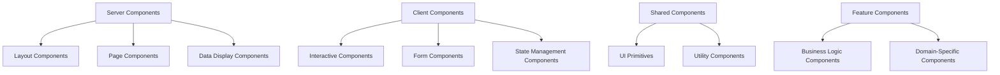

# 🧩 Component Architecture & UI Patterns

This document explains the component architecture used throughout MedBookings, including UI components, form patterns, state management, and composition strategies.

## 📖 What You'll Learn

- **Component Architecture Philosophy**: Server-first, client when needed
- **UI Component System**: shadcn/ui integration and patterns
- **Form Architecture**: React Hook Form + Zod validation patterns
- **State Management**: Local, global, and server state patterns
- **Composition Patterns**: How components work together
- **Performance Patterns**: Optimization strategies

## 🎯 Component Architecture Philosophy

### Server-First Approach

MedBookings uses a **server-first component strategy** where components are server components by default, only becoming client components when interactivity is required.

```typescript
// ✅ Server Component by default (no 'use client')
export default function ProvidersPage() {
  // Server-side data fetching
  const providers = await getProviders();
  
  return (
    <div>
      <h1>Providers</h1>
      {/* Pass data to client components */}
      <ProvidersList initialData={providers} />
    </div>
  );
}

// ✅ Client component only when needed
'use client';

export function ProvidersList({ initialData }: Props) {
  // Interactive features
  const [search, setSearch] = useState('');
  
  return (
    <div>
      <SearchInput value={search} onChange={setSearch} />
      {/* Interactive list */}
    </div>
  );
}
```

### Component Categories



## 🎨 UI Component System

### shadcn/ui Integration

MedBookings uses shadcn/ui as the foundation for its design system, providing consistent, accessible components.

```typescript
// src/components/ui/button.tsx - Base UI component
import { cva, type VariantProps } from 'class-variance-authority';
import { cn } from '@/lib/utils';

const buttonVariants = cva(
  'inline-flex items-center justify-center gap-2 whitespace-nowrap rounded-md text-sm font-medium transition-colors focus-visible:outline-none focus-visible:ring-1 focus-visible:ring-ring disabled:pointer-events-none disabled:opacity-50',
  {
    variants: {
      variant: {
        default: 'bg-primary text-primary-foreground shadow hover:bg-primary/90',
        destructive: 'bg-destructive text-destructive-foreground shadow-sm hover:bg-destructive/90',
        outline: 'border border-input bg-background shadow-sm hover:bg-accent hover:text-accent-foreground',
        secondary: 'bg-secondary text-secondary-foreground shadow-sm hover:bg-secondary/80',
        ghost: 'hover:bg-accent hover:text-accent-foreground',
        link: 'text-primary underline-offset-4 hover:underline',
      },
      size: {
        default: 'h-9 px-4 py-2',
        sm: 'h-8 rounded-md px-3 text-xs',
        lg: 'h-10 rounded-md px-8',
        icon: 'h-12 w-12',
      },
    },
    defaultVariants: {
      variant: 'default',
      size: 'default',
    },
  }
);

export interface ButtonProps
  extends React.ButtonHTMLAttributes<HTMLButtonElement>,
    VariantProps<typeof buttonVariants> {
  asChild?: boolean;
}

const Button = React.forwardRef<HTMLButtonElement, ButtonProps>(
  ({ className, variant, size, asChild = false, ...props }, ref) => {
    const Comp = asChild ? Slot : 'button';
    return (
      <Comp 
        className={cn(buttonVariants({ variant, size, className }))} 
        ref={ref} 
        {...props} 
      />
    );
  }
);
```

**Key Features**:
1. **Class Variance Authority**: Type-safe variant management
2. **Tailwind CSS**: Utility-first styling approach
3. **Radix UI**: Accessible primitives underneath
4. **Forwarded Refs**: Proper ref forwarding for composition
5. **Slot Pattern**: `asChild` for composition flexibility

### Component Composition Patterns

**Compound Component Pattern**:
```typescript
// Form components that work together
const Form = FormRoot;
const FormField = FormFieldComponent;
const FormItem = FormItemComponent;
const FormLabel = FormLabelComponent;
const FormControl = FormControlComponent;
const FormMessage = FormMessageComponent;

// Usage - components compose naturally
<Form {...form}>
  <FormField
    control={form.control}
    name="name"
    render={({ field }) => (
      <FormItem>
        <FormLabel>Name</FormLabel>
        <FormControl>
          <Input {...field} />
        </FormControl>
        <FormMessage />
      </FormItem>
    )}
  />
</Form>
```

**Slot Pattern for Flexibility**:
```typescript
// Button can render as different elements
<Button asChild>
  <Link href="/providers">View Providers</Link>
</Button>
// Renders: <a href="/providers" class="...">View Providers</a>

<Button asChild>
  <div onClick={handleClick}>Custom Div Button</div>
</Button>
// Renders: <div onclick="..." class="...">Custom Div Button</div>
```

## 📋 Form Architecture

### React Hook Form + Zod Integration

```typescript
// Complete form component pattern
'use client';

import { zodResolver } from '@hookform/resolvers/zod';
import { useForm } from 'react-hook-form';
import { z } from 'zod';

// 1. Define validation schema
const providerSchema = z.object({
  name: z.string().min(1, 'Name is required'),
  bio: z.string().max(1000, 'Bio must be under 1000 characters').optional(),
  languages: z.array(z.nativeEnum(Languages)).min(1, 'At least one language required'),
  website: z.string().url('Must be a valid URL').optional(),
});

type ProviderFormData = z.infer<typeof providerSchema>;

export function ProviderForm({ provider, onSubmit }: Props) {
  // 2. Initialize form with type safety
  const form = useForm<ProviderFormData>({
    resolver: zodResolver(providerSchema),
    defaultValues: {
      name: provider?.name || '',
      bio: provider?.bio || '',
      languages: provider?.languages || [],
      website: provider?.website || '',
    },
    mode: 'onBlur', // Validate on blur for better UX
  });

  // 3. Form submission handler
  const handleSubmit = form.handleSubmit(async (data) => {
    try {
      await onSubmit(data);
      form.reset(); // Clear form on success
    } catch (error) {
      // Handle errors
      form.setError('root', { 
        message: 'Failed to save provider' 
      });
    }
  });

  return (
    <Form {...form}>
      <form onSubmit={handleSubmit} className="space-y-6">
        {/* Name field */}
        <FormField
          control={form.control}
          name="name"
          render={({ field }) => (
            <FormItem>
              <FormLabel>Name</FormLabel>
              <FormControl>
                <Input {...field} />
              </FormControl>
              <FormMessage />
            </FormItem>
          )}
        />

        {/* Bio field */}
        <FormField
          control={form.control}
          name="bio"
          render={({ field }) => (
            <FormItem>
              <FormLabel>Bio</FormLabel>
              <FormControl>
                <Textarea 
                  {...field} 
                  placeholder="Tell patients about your experience..."
                />
              </FormControl>
              <FormDescription>
                Optional: Brief description of your background (max 1000 chars)
              </FormDescription>
              <FormMessage />
            </FormItem>
          )}
        />

        {/* Languages field with custom component */}
        <FormField
          control={form.control}
          name="languages"
          render={({ field }) => (
            <FormItem>
              <FormLabel>Languages Spoken</FormLabel>
              <FormControl>
                <LanguageSelector 
                  selected={field.value}
                  onChange={field.onChange}
                />
              </FormControl>
              <FormMessage />
            </FormItem>
          )}
        />

        {/* Submit button with loading state */}
        <div className="flex justify-end space-x-4">
          <Button 
            type="button" 
            variant="outline" 
            onClick={() => form.reset()}
          >
            Reset
          </Button>
          <Button 
            type="submit" 
            disabled={form.formState.isSubmitting}
          >
            {form.formState.isSubmitting ? 'Saving...' : 'Save Provider'}
          </Button>
        </div>

        {/* Root error display */}
        {form.formState.errors.root && (
          <Alert variant="destructive">
            <AlertCircle className="h-4 w-4" />
            <AlertTitle>Error</AlertTitle>
            <AlertDescription>
              {form.formState.errors.root.message}
            </AlertDescription>
          </Alert>
        )}
      </form>
    </Form>
  );
}
```

### Advanced Form Patterns

**Multi-Step Form with State Management**:
```typescript
// Multi-step form component
export function ProviderOnboardingForm() {
  const [currentStep, setCurrentStep] = useState(1);
  const [formErrors, setFormErrors] = useState<string[]>([]);

  const methods = useForm<ProviderFormType>({
    resolver: zodResolver(providerFormSchema),
    defaultValues: {
      basicInfo: { /* ... */ },
      services: { /* ... */ },
      requirements: { /* ... */ },
    },
    mode: 'onBlur',
  });

  // Watch specific fields to orchestrate data flow
  const watchedProviderTypeIds = methods.watch('providerTypeIds');
  
  // Update form state when dependencies change
  useEffect(() => {
    if (watchedProviderTypeIds.length > 0) {
      // Load services and requirements based on provider types
      const requirements = getRequirementsForTypes(watchedProviderTypeIds);
      const services = getServicesForTypes(watchedProviderTypeIds);
      
      methods.setValue('requirements.available', requirements);
      methods.setValue('services.available', services);
    }
  }, [watchedProviderTypeIds, methods]);

  const handleStepSubmit = async (step: number) => {
    // Validate current step
    const isValid = await methods.trigger(getFieldsForStep(step));
    
    if (isValid) {
      setCurrentStep(step + 1);
    } else {
      // Show errors for current step
      updateFormErrors();
    }
  };

  return (
    <FormProvider {...methods}>
      <form className="space-y-8">
        {/* Step indicator */}
        <StepIndicator currentStep={currentStep} totalSteps={4} />
        
        {/* Dynamic step content */}
        {currentStep === 1 && <BasicInfoStep />}
        {currentStep === 2 && <ServicesStep />}
        {currentStep === 3 && <RequirementsStep />}
        {currentStep === 4 && <ReviewStep />}
        
        {/* Navigation buttons */}
        <StepNavigation 
          currentStep={currentStep}
          onNext={() => handleStepSubmit(currentStep)}
          onPrevious={() => setCurrentStep(currentStep - 1)}
        />
      </form>
    </FormProvider>
  );
}
```

**File Upload Integration**:
```typescript
// Document uploader component with validation
export function DocumentUploader({
  onUpload,
  acceptedFormats = ['.pdf', '.jpg', '.png'],
  currentFileUrl,
  directory = 'documents',
  purpose, // Required for file naming
}: DocumentUploaderProps) {
  const [isUploading, setIsUploading] = useState(false);
  const [uploadProgress, setUploadProgress] = useState(0);
  const [uploadedFile, setUploadedFile] = useState<FileData | null>(null);

  const validateFile = (file: File) => {
    const fileExt = `.${file.name.split('.').pop()?.toLowerCase()}`;
    
    if (!acceptedFormats.some(format => fileExt.endsWith(format.toLowerCase()))) {
      toast({
        title: 'Invalid file type',
        description: `Please upload: ${acceptedFormats.join(', ')}`,
        variant: 'destructive',
      });
      return false;
    }

    if (file.size > 10 * 1024 * 1024) { // 10MB limit
      toast({
        title: 'File too large',
        description: 'Please upload a file smaller than 10MB',
        variant: 'destructive',
      });
      return false;
    }

    return true;
  };

  const handleFileUpload = async (file: File) => {
    if (!validateFile(file)) return;

    setIsUploading(true);
    setUploadProgress(0);

    try {
      // Progress animation
      const interval = setInterval(() => {
        setUploadProgress(prev => prev >= 90 ? 90 : prev + 10);
      }, 100);

      // Upload to Vercel Blob
      const formData = new FormData();
      formData.append('file', file);
      formData.append('directory', directory);
      formData.append('purpose', purpose);

      const response = await fetch('/api/upload', {
        method: 'POST',
        body: formData,
      });

      clearInterval(interval);
      
      if (!response.ok) throw new Error('Upload failed');

      const result = await response.json();
      setUploadProgress(100);

      const fileData = {
        name: file.name,
        size: file.size,
        type: file.type,
        url: result.url,
        uploadedAt: new Date().toISOString(),
      };

      setUploadedFile(fileData);
      onUpload(result.url); // Notify parent

      toast({
        title: 'File uploaded successfully',
        description: `${file.name} has been uploaded.`,
      });
    } catch (error) {
      toast({
        title: 'Upload failed',
        description: 'Please try again.',
        variant: 'destructive',
      });
    } finally {
      setIsUploading(false);
    }
  };

  // Drag and drop handlers
  const handleDrop = (e: React.DragEvent) => {
    e.preventDefault();
    const files = e.dataTransfer.files;
    if (files?.[0]) handleFileUpload(files[0]);
  };

  return (
    <div className="space-y-4">
      {uploadedFile ? (
        <UploadedFileDisplay file={uploadedFile} onRemove={() => setUploadedFile(null)} />
      ) : (
        <DropZone 
          onDrop={handleDrop}
          onFileSelect={handleFileUpload}
          acceptedFormats={acceptedFormats}
          isUploading={isUploading}
        />
      )}
      
      {isUploading && (
        <UploadProgress progress={uploadProgress} />
      )}
    </div>
  );
}
```

## 🏗️ State Management Patterns

### Local State (useState, useReducer)

```typescript
// Simple local state for UI interactions
function ProviderCard({ provider }: Props) {
  const [isExpanded, setIsExpanded] = useState(false);
  const [showActions, setShowActions] = useState(false);
  
  return (
    <Card 
      onMouseEnter={() => setShowActions(true)}
      onMouseLeave={() => setShowActions(false)}
    >
      <CardContent>
        <h3>{provider.name}</h3>
        {isExpanded && <p>{provider.bio}</p>}
        
        <Button onClick={() => setIsExpanded(!isExpanded)}>
          {isExpanded ? 'Show Less' : 'Show More'}
        </Button>
        
        {showActions && (
          <div className="action-buttons">
            <Button>Edit</Button>
            <Button>Delete</Button>
          </div>
        )}
      </CardContent>
    </Card>
  );
}

// Complex local state with useReducer
type FormState = {
  currentStep: number;
  completedSteps: Set<number>;
  data: Partial<FormData>;
  errors: Record<string, string>;
};

type FormAction = 
  | { type: 'NEXT_STEP' }
  | { type: 'PREVIOUS_STEP' }
  | { type: 'SET_DATA'; payload: Partial<FormData> }
  | { type: 'SET_ERRORS'; payload: Record<string, string> };

function formReducer(state: FormState, action: FormAction): FormState {
  switch (action.type) {
    case 'NEXT_STEP':
      return {
        ...state,
        currentStep: state.currentStep + 1,
        completedSteps: new Set([...state.completedSteps, state.currentStep]),
      };
    case 'PREVIOUS_STEP':
      return {
        ...state,
        currentStep: Math.max(1, state.currentStep - 1),
      };
    case 'SET_DATA':
      return {
        ...state,
        data: { ...state.data, ...action.payload },
      };
    case 'SET_ERRORS':
      return {
        ...state,
        errors: action.payload,
      };
    default:
      return state;
  }
}

function MultiStepForm() {
  const [state, dispatch] = useReducer(formReducer, {
    currentStep: 1,
    completedSteps: new Set(),
    data: {},
    errors: {},
  });
  
  const nextStep = () => dispatch({ type: 'NEXT_STEP' });
  const previousStep = () => dispatch({ type: 'PREVIOUS_STEP' });
  
  return (
    <div>
      <StepIndicator 
        currentStep={state.currentStep}
        completedSteps={state.completedSteps}
      />
      {/* Form steps */}
    </div>
  );
}
```

### Global State (Context + useReducer)

```typescript
// Global UI state context
type UIState = {
  sidebarOpen: boolean;
  theme: 'light' | 'dark' | 'system';
  notifications: Notification[];
};

type UIAction = 
  | { type: 'TOGGLE_SIDEBAR' }
  | { type: 'SET_THEME'; payload: UIState['theme'] }
  | { type: 'ADD_NOTIFICATION'; payload: Notification }
  | { type: 'REMOVE_NOTIFICATION'; payload: string };

const UIContext = createContext<{
  state: UIState;
  dispatch: Dispatch<UIAction>;
} | null>(null);

function uiReducer(state: UIState, action: UIAction): UIState {
  switch (action.type) {
    case 'TOGGLE_SIDEBAR':
      return { ...state, sidebarOpen: !state.sidebarOpen };
    case 'SET_THEME':
      return { ...state, theme: action.payload };
    case 'ADD_NOTIFICATION':
      return { 
        ...state, 
        notifications: [...state.notifications, action.payload] 
      };
    case 'REMOVE_NOTIFICATION':
      return { 
        ...state, 
        notifications: state.notifications.filter(n => n.id !== action.payload) 
      };
    default:
      return state;
  }
}

export function UIProvider({ children }: { children: ReactNode }) {
  const [state, dispatch] = useReducer(uiReducer, {
    sidebarOpen: true,
    theme: 'system',
    notifications: [],
  });

  return (
    <UIContext.Provider value={{ state, dispatch }}>
      {children}
    </UIContext.Provider>
  );
}

// Custom hook for using UI context
export function useUI() {
  const context = useContext(UIContext);
  if (!context) {
    throw new Error('useUI must be used within UIProvider');
  }
  return context;
}
```

### Server State (tRPC + TanStack Query)

```typescript
// Server state management with tRPC hooks
function ProviderManagement() {
  // Query data with automatic caching
  const {
    data: providers,
    isLoading,
    error,
    refetch,
  } = api.providers.getAll.useQuery({
    limit: 10,
    search: '',
  });

  // Mutation with optimistic updates
  const utils = api.useContext();
  const updateProvider = api.providers.update.useMutation({
    onMutate: async (variables) => {
      // Cancel outgoing refetches
      await utils.providers.getAll.cancel();
      
      // Snapshot previous value
      const previousProviders = utils.providers.getAll.getData();
      
      // Optimistically update
      utils.providers.getAll.setData({}, old => 
        old?.map(p => p.id === variables.id ? { ...p, ...variables } : p)
      );
      
      return { previousProviders };
    },
    onError: (err, variables, context) => {
      // Rollback on error
      if (context?.previousProviders) {
        utils.providers.getAll.setData({}, context.previousProviders);
      }
    },
    onSuccess: () => {
      // Invalidate to ensure fresh data
      utils.providers.getAll.invalidate();
    },
  });

  const handleUpdateProvider = (id: string, updates: Partial<Provider>) => {
    updateProvider.mutate({ id, ...updates });
  };

  if (isLoading) return <LoadingSpinner />;
  if (error) return <ErrorMessage error={error} onRetry={refetch} />;

  return (
    <div>
      {providers?.map(provider => (
        <ProviderCard
          key={provider.id}
          provider={provider}
          onUpdate={(updates) => handleUpdateProvider(provider.id, updates)}
        />
      ))}
    </div>
  );
}
```

## 🎭 Composition Patterns

### Container/Presenter Pattern

```typescript
// Container Component (Logic & Data)
function ProviderFormContainer({ providerId }: Props) {
  // Data fetching
  const { data: provider, isLoading } = api.providers.getById.useQuery({ 
    id: providerId 
  });
  
  // Mutations
  const updateProvider = api.providers.update.useMutation();
  const deleteProvider = api.providers.delete.useMutation();
  
  // Business logic
  const handleSubmit = async (data: ProviderFormData) => {
    try {
      await updateProvider.mutateAsync({ id: providerId, ...data });
      toast.success('Provider updated successfully');
    } catch (error) {
      toast.error('Failed to update provider');
    }
  };

  const handleDelete = async () => {
    if (confirm('Are you sure you want to delete this provider?')) {
      await deleteProvider.mutateAsync({ id: providerId });
    }
  };

  if (isLoading) return <ProviderFormSkeleton />;

  return (
    <ProviderForm
      provider={provider}
      onSubmit={handleSubmit}
      onDelete={handleDelete}
      isSubmitting={updateProvider.isLoading}
      isDeleting={deleteProvider.isLoading}
    />
  );
}

// Presenter Component (Pure UI)
function ProviderForm({ 
  provider, 
  onSubmit, 
  onDelete, 
  isSubmitting, 
  isDeleting 
}: Props) {
  const form = useForm({
    defaultValues: provider,
    resolver: zodResolver(providerSchema),
  });

  return (
    <Form {...form}>
      <form onSubmit={form.handleSubmit(onSubmit)}>
        {/* Form fields */}
        
        <div className="flex justify-between">
          <Button
            type="button"
            variant="destructive"
            onClick={onDelete}
            disabled={isDeleting}
          >
            {isDeleting ? 'Deleting...' : 'Delete Provider'}
          </Button>
          
          <Button type="submit" disabled={isSubmitting}>
            {isSubmitting ? 'Saving...' : 'Save Changes'}
          </Button>
        </div>
      </form>
    </Form>
  );
}
```

### Render Props Pattern

```typescript
// Flexible data fetcher with render props
function DataFetcher<T>({ 
  queryKey, 
  queryFn, 
  children 
}: {
  queryKey: string[];
  queryFn: () => Promise<T>;
  children: (data: {
    data: T | undefined;
    isLoading: boolean;
    error: Error | null;
    refetch: () => void;
  }) => ReactNode;
}) {
  const query = useQuery({
    queryKey,
    queryFn,
  });

  return <>{children(query)}</>;
}

// Usage
function ProvidersList() {
  return (
    <DataFetcher
      queryKey={['providers']}
      queryFn={() => fetchProviders()}
    >
      {({ data: providers, isLoading, error, refetch }) => {
        if (isLoading) return <LoadingSkeleton />;
        if (error) return <ErrorMessage onRetry={refetch} />;
        
        return (
          <div>
            {providers?.map(provider => (
              <ProviderCard key={provider.id} provider={provider} />
            ))}
          </div>
        );
      }}
    </DataFetcher>
  );
}
```

### Higher-Order Components (HOCs)

```typescript
// Error boundary HOC
function withErrorBoundary<P extends object>(
  Component: ComponentType<P>,
  fallback?: ComponentType<{ error: Error; reset: () => void }>
) {
  return function WithErrorBoundaryComponent(props: P) {
    return (
      <ErrorBoundary fallback={fallback || DefaultErrorFallback}>
        <Component {...props} />
      </ErrorBoundary>
    );
  };
}

// Loading HOC
function withLoading<P extends object>(
  Component: ComponentType<P>,
  loader?: ComponentType
) {
  return function WithLoadingComponent(props: P & { isLoading?: boolean }) {
    const { isLoading, ...componentProps } = props;
    
    if (isLoading) {
      return loader ? <loader /> : <DefaultLoader />;
    }
    
    return <Component {...(componentProps as P)} />;
  };
}

// Usage
const ProviderFormWithErrorBoundary = withErrorBoundary(
  withLoading(ProviderForm, ProviderFormSkeleton),
  ProviderFormErrorFallback
);
```

## ⚡ Performance Patterns

### Memoization Strategies

```typescript
// Expensive component memoization
const ExpensiveProviderCard = React.memo(function ProviderCard({ 
  provider, 
  onUpdate 
}: Props) {
  // Expensive calculations
  const stats = useMemo(() => {
    return calculateProviderStats(provider);
  }, [provider]);

  // Memoized event handlers
  const handleUpdate = useCallback((updates: Partial<Provider>) => {
    onUpdate(provider.id, updates);
  }, [provider.id, onUpdate]);

  return (
    <Card>
      <CardContent>
        <h3>{provider.name}</h3>
        <div>
          <span>Rating: {stats.averageRating}</span>
          <span>Reviews: {stats.totalReviews}</span>
        </div>
        <Button onClick={() => handleUpdate({ featured: true })}>
          Feature Provider
        </Button>
      </CardContent>
    </Card>
  );
}, (prevProps, nextProps) => {
  // Custom comparison function
  return (
    prevProps.provider.id === nextProps.provider.id &&
    prevProps.provider.updatedAt === nextProps.provider.updatedAt
  );
});
```

### Lazy Loading & Code Splitting

```typescript
// Route-level lazy loading
const ProviderManagement = lazy(() => import('./provider-management'));
const OrganizationDashboard = lazy(() => import('./organization-dashboard'));

function AdminRoutes() {
  return (
    <Suspense fallback={<PageLoader />}>
      <Routes>
        <Route path="/providers" element={<ProviderManagement />} />
        <Route path="/organizations" element={<OrganizationDashboard />} />
      </Routes>
    </Suspense>
  );
}

// Component-level lazy loading
const HeavyChart = lazy(() => import('./heavy-chart'));

function Dashboard() {
  const [showChart, setShowChart] = useState(false);

  return (
    <div>
      <h1>Dashboard</h1>
      <Button onClick={() => setShowChart(true)}>
        Show Chart
      </Button>
      
      {showChart && (
        <Suspense fallback={<ChartSkeleton />}>
          <HeavyChart />
        </Suspense>
      )}
    </div>
  );
}
```

### Virtual Scrolling for Large Lists

```typescript
// Virtual list for performance with large datasets
import { FixedSizeList as List } from 'react-window';

function VirtualizedProvidersList({ providers }: Props) {
  const Row = ({ index, style }: { index: number; style: CSSProperties }) => (
    <div style={style}>
      <ProviderCard provider={providers[index]} />
    </div>
  );

  return (
    <List
      height={600}        // Container height
      itemCount={providers.length}
      itemSize={150}      // Height of each item
      width="100%"
    >
      {Row}
    </List>
  );
}
```

## 🎯 Best Practices Summary

### Component Design
1. **Server-First**: Default to server components
2. **Single Responsibility**: Each component has one clear purpose
3. **Composition Over Inheritance**: Use composition patterns
4. **Type Safety**: Full TypeScript throughout

### Performance
1. **Memoization**: Use React.memo for expensive components
2. **Callback Memoization**: useCallback for event handlers
3. **Lazy Loading**: Code split heavy components
4. **Virtual Scrolling**: For large datasets

### State Management
1. **Local First**: Use local state when possible
2. **Lift State Up**: When multiple components need shared state
3. **Server State**: Use tRPC + TanStack Query
4. **Global State**: Context for cross-cutting concerns

### Form Handling
1. **React Hook Form**: For all forms
2. **Zod Validation**: Schema-first validation
3. **Type Safety**: Infer types from schemas
4. **Error Handling**: Comprehensive error display

## 🔗 Related Documentation

- [Core Architecture Overview](../core/architecture-overview.md) - System design patterns
- [Feature Module Pattern](../features/feature-module-pattern.md) - Feature organization
- [tRPC Architecture](../api/trpc-architecture.md) - Server state management
- [Next.js App Router](../nextjs/app-router-structure.md) - Server/client component patterns

---

*This component architecture provides a scalable, maintainable foundation for building complex user interfaces while maintaining excellent performance and developer experience.*