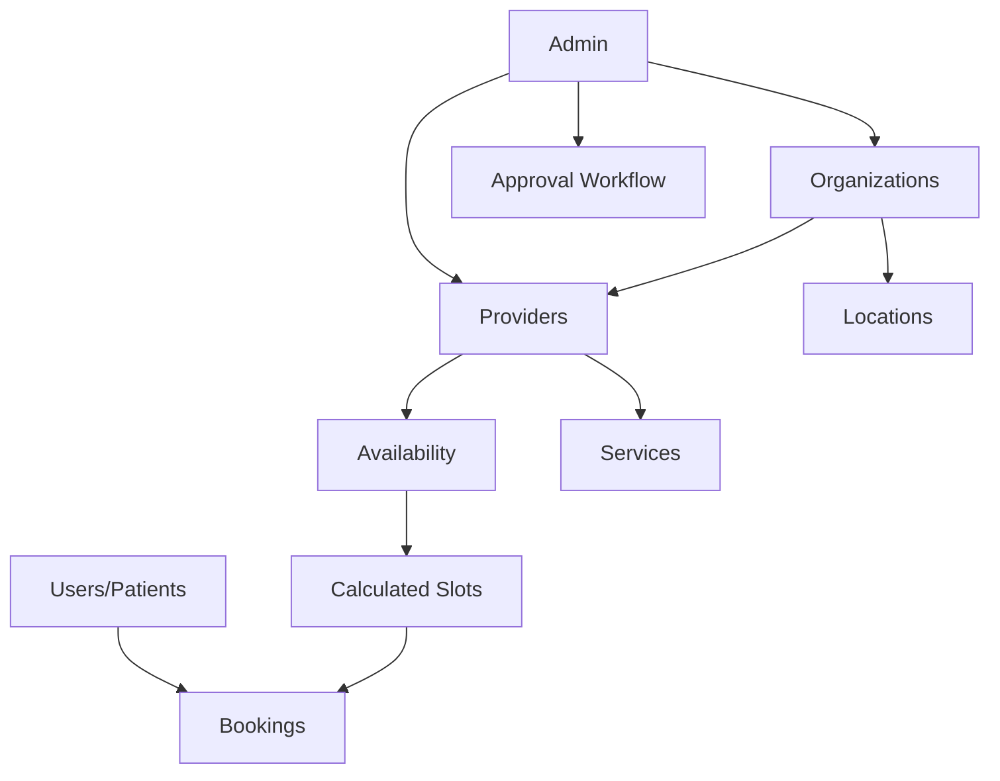
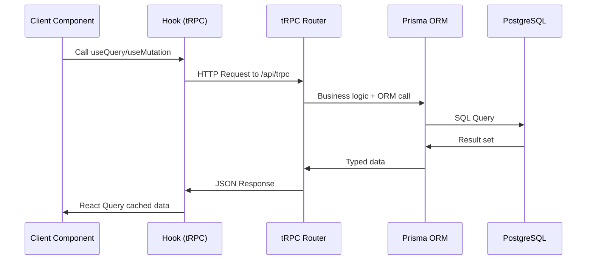
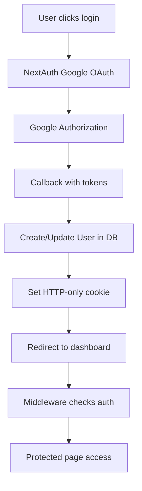
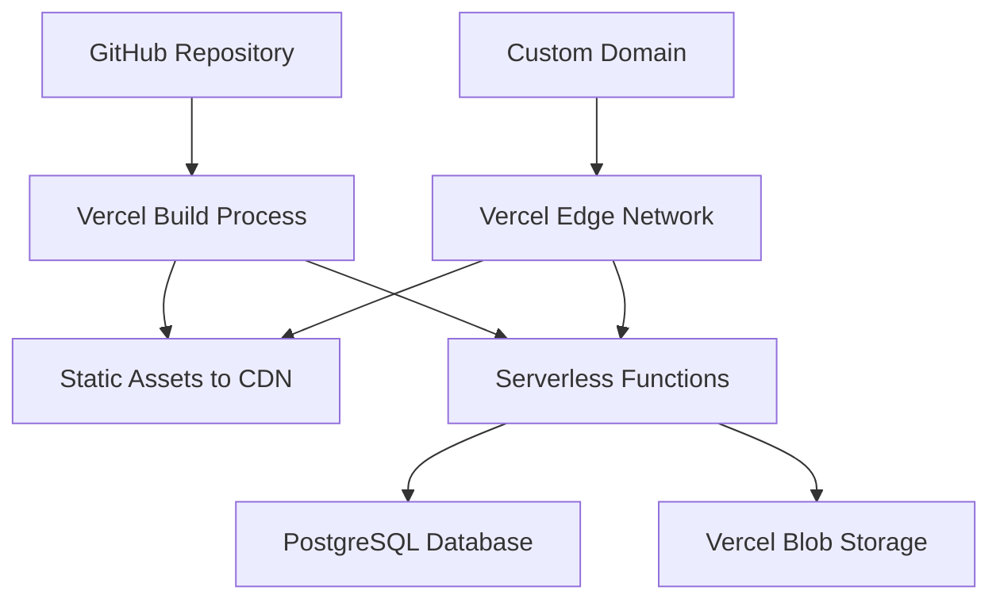

# 🏗️ Core Architecture Overview

This document explains the high-level architecture of MedBookings, providing the foundational understanding every developer needs to work effectively with the codebase.

## 📖 What You'll Learn

- **System Design Philosophy**: Why MedBookings is built this way
- **Technology Stack Decisions**: What we use and why
- **Architectural Patterns**: Core patterns used throughout
- **Component Interaction**: How different parts work together
- **Data Flow**: How information moves through the system

## 🎯 System Overview

MedBookings is a **medical appointment booking platform** that serves four distinct user types:

1. **🏥 Healthcare Organizations** - Manage multiple providers and locations
2. **👨‍⚕️ Healthcare Providers** - Individual practitioners managing their practice  
3. **👤 Patients/Users** - Book appointments and manage health records
4. **🛡️ System Administrators** - Platform oversight and compliance

### Core Business Model



## 🛠️ Technology Stack Deep Dive

### Frontend Architecture: Next.js 14 + React

**Why Next.js App Router?**
- **File-based Routing**: Automatic route generation
- **Server Components**: Reduced JavaScript bundle size
- **Nested Layouts**: Efficient page composition  
- **Built-in Optimization**: Image, font, and bundle optimization

```typescript
// Example: App Router structure
src/app/
├── (dashboard)/          // Route Group (doesn't affect URL)
│   ├── layout.tsx       // Shared dashboard layout
│   └── providers/       
│       └── page.tsx     // URL: /providers
└── (general)/           // Route Group
    ├── layout.tsx       // Different layout
    └── page.tsx         // URL: / (homepage)
```

**Component Architecture Philosophy**:
- **Server Components by Default**: Render on server unless interactivity needed
- **Client Components**: Only when user interaction required
- **Hybrid Approach**: Server + Client components working together

### Backend Architecture: Full-Stack Next.js

**Why Full-Stack Next.js?**
- **Unified Development**: One codebase for frontend and backend
- **Serverless Functions**: Automatic scaling via Vercel
- **Edge Runtime**: Global performance optimization
- **Type Safety**: Shared types between frontend and backend

```typescript
// Example: tRPC Router Pattern
export const providerRouter = createTRPCRouter({
  getById: publicProcedure
    .input(z.object({ id: z.string() }))
    .query(async ({ input, ctx }) => {
      // Server-side logic with full type safety
      return ctx.prisma.provider.findUnique({
        where: { id: input.id },
        include: { user: true, services: true }
      });
    }),
});
```

### Database Architecture: PostgreSQL + Prisma

**Why PostgreSQL?**
- **ACID Compliance**: Essential for booking systems
- **JSON Support**: Flexible data structures for configurations  
- **Strong Indexing**: Fast complex queries for availability
- **Scalability**: Handles concurrent booking scenarios

**Why Prisma ORM?**
- **Type Safety**: Generated TypeScript types from schema
- **Migration System**: Version-controlled database changes
- **Query Builder**: Intuitive, performant queries
- **Introspection**: Automatic type generation

```typescript
// Example: Prisma relationship handling
model Booking {
  id      String @id @default(cuid())
  slot    CalculatedAvailabilitySlot @relation(fields: [slotId], references: [id])
  slotId  String @unique
  
  // Automatic TypeScript types generated:
  // booking.slot.availability.provider.user.name
}
```

## 🏛️ Architectural Patterns

### 1. Feature-Based Architecture

**Philosophy**: Group related functionality together rather than by technical layer.

```typescript
src/features/
├── providers/           // Everything provider-related
│   ├── components/     // Provider UI components
│   ├── hooks/         // Provider-specific hooks  
│   ├── lib/           // Provider business logic
│   └── types/         // Provider type definitions
```

**Benefits**:
- **Cohesion**: Related code stays together
- **Maintainability**: Easy to find and modify features
- **Team Scalability**: Teams can own entire features
- **Testing**: Feature-level test organization

### 2. Domain-Driven Design (DDD)

**Core Domains Identified**:

```typescript
// Business Domain Entities
Provider      // Healthcare practitioners
Organization  // Healthcare organizations  
User         // Platform users (patients/admins)
Booking      // Appointment bookings
Availability // Provider time slots
Service      // Medical services offered
```

**Domain Boundaries**:
- Each feature module represents a bounded context
- Clear interfaces between domains
- Business logic encapsulated within domains

### 3. CQRS (Command Query Responsibility Segregation)

**Commands** (Write Operations):
```typescript
// tRPC Mutations - Change state
createProvider: protectedProcedure
  .input(createProviderSchema)
  .mutation(async ({ input, ctx }) => {
    // Write operation with side effects
    return ctx.prisma.provider.create({ data: input });
  })
```

**Queries** (Read Operations):
```typescript  
// tRPC Queries - Read state
getProvider: publicProcedure
  .input(z.object({ id: z.string() }))
  .query(async ({ input, ctx }) => {
    // Read operation, no side effects
    return ctx.prisma.provider.findUnique({ where: { id: input.id } });
  })
```

### 4. Layered Architecture

```
┌─────────────────┐
│   Presentation   │  Next.js Pages & Components
│      Layer       │  
├─────────────────┤
│   Application    │  tRPC Routers & Procedures
│      Layer       │  
├─────────────────┤  
│    Domain       │  Business Logic & Rules
│      Layer       │  
├─────────────────┤
│ Infrastructure  │  Prisma ORM & Database
│     Layer       │  
└─────────────────┘
```

## 🔄 Data Flow Architecture

### Request Lifecycle



### State Management Strategy

**Server State** (External Data):
- **Tool**: TanStack Query (React Query) via tRPC
- **Caching**: Automatic with configurable strategies
- **Synchronization**: Background refetching
- **Optimistic Updates**: Immediate UI feedback

**Client State** (UI State):
- **Tool**: React useState/useReducer
- **Scope**: Component-local or shared via context
- **Persistence**: Session/localStorage when needed

**Example State Flow**:
```typescript
// 1. Component requests data
const { data: providers, isLoading } = api.providers.getAll.useQuery();

// 2. User interaction triggers mutation  
const createProvider = api.providers.create.useMutation({
  onSuccess: () => {
    // 3. Automatic cache invalidation
    utils.providers.getAll.invalidate();
  }
});
```

### Authentication Flow



## 🎭 Component Patterns

### 1. Server-First Pattern

**Default to Server Components**:
```typescript
// app/providers/page.tsx - Server Component
export default async function ProvidersPage() {
  // Data fetching on server
  const providers = await getProviders();
  
  return (
    <div>
      <h1>Providers</h1>
      {/* Pass data to client component */}
      <ProviderList initialData={providers} />
    </div>
  );
}
```

**Client Components Only When Needed**:
```typescript
// components/provider-list.tsx - Client Component
'use client';

export function ProviderList({ initialData }: Props) {
  // Interactive features
  const [search, setSearch] = useState('');
  
  return (
    <div>
      <SearchInput value={search} onChange={setSearch} />
      {/* ... */}
    </div>
  );
}
```

### 2. Composition Pattern

**Container/Presenter Pattern**:
```typescript
// Container Component (logic)
export function ProviderFormContainer({ providerId }: Props) {
  const { data, isLoading } = api.providers.getById.useQuery({ id: providerId });
  const updateProvider = api.providers.update.useMutation();
  
  if (isLoading) return <ProviderFormSkeleton />;
  
  return (
    <ProviderForm 
      provider={data}
      onSubmit={updateProvider.mutate}
      isSubmitting={updateProvider.isLoading}
    />
  );
}

// Presenter Component (UI)  
export function ProviderForm({ provider, onSubmit, isSubmitting }: Props) {
  // Pure UI logic
  return <form>{/* ... */}</form>;
}
```

### 3. Error Boundary Pattern

```typescript
// Automatic error recovery
export function ProviderSection() {
  return (
    <ErrorBoundary fallback={<ProviderErrorFallback />}>
      <Suspense fallback={<ProviderSkeleton />}>
        <ProviderContent />
      </Suspense>
    </ErrorBoundary>
  );
}
```

## 🔒 Security Architecture

### Authentication Strategy
- **NextAuth.js**: Industry-standard OAuth implementation
- **Google OAuth**: Primary authentication provider
- **HTTP-only Cookies**: Secure token storage
- **CSRF Protection**: Built-in Next.js protection

### Authorization Strategy  
- **Role-Based Access Control (RBAC)**: USER, ADMIN, SUPER_ADMIN
- **Resource-Based Permissions**: Own resources only
- **Middleware Protection**: Route-level authorization
- **API-Level Guards**: tRPC procedure protection

```typescript
// Authorization example
export const adminProcedure = protectedProcedure.use(async ({ ctx, next }) => {
  const user = await getCurrentUser(ctx);
  if (!['ADMIN', 'SUPER_ADMIN'].includes(user.role)) {
    throw new TRPCError({ code: 'UNAUTHORIZED' });
  }
  return next({ ctx: { ...ctx, user } });
});
```

### Data Protection
- **Input Validation**: Zod schemas for all inputs
- **SQL Injection Prevention**: Prisma ORM protection
- **XSS Prevention**: React built-in protection + sanitization
- **File Upload Security**: Type validation and secure storage

## 📊 Performance Architecture

### Optimization Strategies

**Frontend Performance**:
- **Code Splitting**: Automatic route-based splitting
- **Image Optimization**: Next.js Image component
- **Bundle Analysis**: Regular size monitoring
- **Lazy Loading**: Component and route lazy loading

**Backend Performance**:
- **Database Indexing**: Strategic index placement
- **Query Optimization**: Efficient Prisma queries
- **Caching**: Multi-level caching strategy
- **Serverless Optimization**: Cold start minimization

**Example Query Optimization**:
```typescript
// Optimized query with strategic includes
const provider = await prisma.provider.findUnique({
  where: { id },
  include: {
    user: { select: { name: true, email: true } }, // Only needed fields
    services: { where: { isActive: true } },        // Filter at DB level
  }
});
```

## 🔄 Development Workflow Integration

### Technical Planning System
- **Feature Planning**: Technical analysis before PRD
- **Issue Resolution**: Root cause analysis first
- **Implementation**: Structured development phases
- **Quality Gates**: Linting, type checking, testing

### Code Quality Assurance
- **TypeScript Strict Mode**: Maximum type safety
- **ESLint + Prettier**: Consistent code formatting
- **Pre-commit Hooks**: Automated quality checks
- **Build Verification**: Deployment readiness

## 🚀 Deployment Architecture

### Vercel Platform Integration


### Environment Strategy
- **Development**: Local PostgreSQL, local file storage
- **Production**: Vercel PostgreSQL, Vercel Blob storage  
- **Environment Variables**: Secure configuration management
- **Feature Flags**: Gradual feature rollouts

## 🎯 Key Architectural Decisions

### Decision 1: Full-Stack Next.js vs Separate Backend
**Chosen**: Full-Stack Next.js  
**Reasoning**: 
- Simplified deployment and development
- Shared type safety
- Better performance (no network boundary)
- Reduced complexity

### Decision 2: Prisma vs Raw SQL
**Chosen**: Prisma ORM
**Reasoning**:
- Type safety throughout data layer
- Migration management
- Development productivity  
- Query performance acceptable

### Decision 3: tRPC vs REST API
**Chosen**: tRPC with REST for special cases
**Reasoning**:
- End-to-end type safety
- Better developer experience
- Automatic API documentation
- REST for file uploads and webhooks

### Decision 4: Feature Modules vs Layer Architecture  
**Chosen**: Feature-based modules
**Reasoning**:
- Better code organization
- Team scalability
- Easier maintenance
- Domain-driven development

## 🔍 Monitoring & Observability

### Error Tracking
- **Client Errors**: React Error Boundaries
- **Server Errors**: Centralized error handling
- **Database Errors**: Prisma error handling
- **API Errors**: tRPC error handling

### Performance Monitoring
- **Core Web Vitals**: Frontend performance metrics
- **API Response Times**: Backend performance
- **Database Query Performance**: Slow query monitoring
- **User Experience Metrics**: Real user monitoring

## 📚 Next Steps for New Developers

1. **Read**: [Project Structure Deep Dive](./project-structure-explained.md)
2. **Explore**: [Feature Module Pattern](../features/feature-module-pattern.md)  
3. **Practice**: [Development Workflow](../workflow/development-process.md)
4. **Deep Dive**: Pick a specific area that interests you

## 🔗 Related Documentation

- [Project Structure Deep Dive](./project-structure-explained.md) - Detailed folder organization
- [Data Flow Patterns](./data-flow-patterns.md) - How data moves through the system  
- [Type System Guide](./type-system-guide.md) - TypeScript patterns and conventions
- [Development Workflow](../workflow/development-process.md) - How to develop features

---

*This architecture overview provides the foundation for understanding all other aspects of the MedBookings codebase. Every architectural decision mentioned here has specific implementation details covered in the related documentation.*