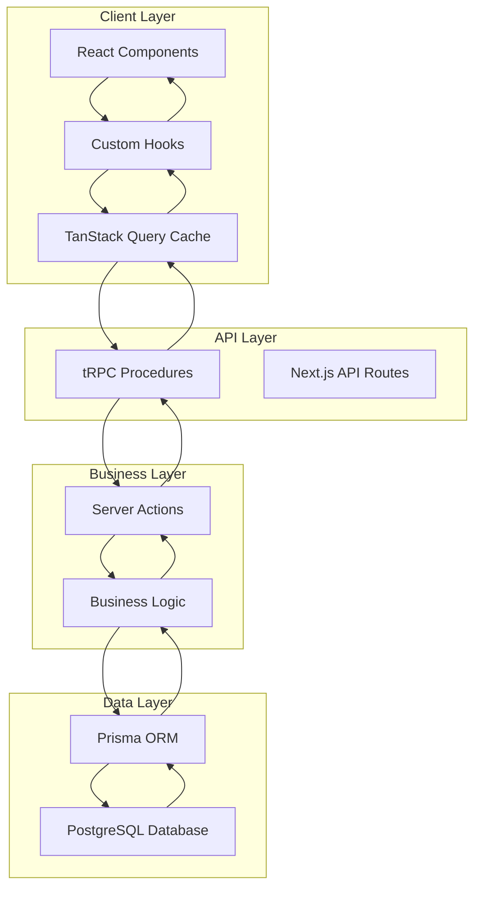
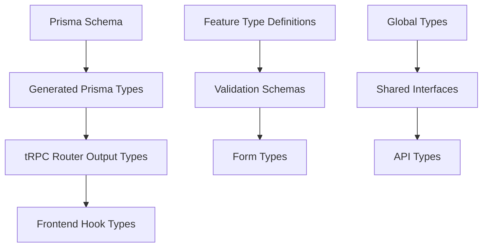

# 🔄 Data Flow Patterns

This document explains how data moves through the MedBookings system, from database to user interface and back, including the type system that ensures everything stays connected and safe.

## 📖 What You'll Learn

- **Data Flow Architecture**: How information travels through the system
- **Type System Strategy**: How TypeScript types are managed and shared
- **State Management Patterns**: Client and server state handling
- **API Integration**: How frontend communicates with backend
- **Caching Strategies**: How data is cached and invalidated

## 🌊 Overall Data Flow Architecture



## 🎯 Core Data Flow Patterns

### 1. Request-Response Flow

**Complete Request Lifecycle**:
```typescript
// 1. Component initiates request
function ProviderList() {
  const { data: providers, isLoading } = api.providers.getAll.useQuery();
  
  if (isLoading) return <Loading />;
  return (
    <div>
      {providers?.map(provider => (
        <ProviderCard key={provider.id} provider={provider} />
      ))}
    </div>
  );
}

// 2. Hook wraps tRPC query
export const useProviders = () => {
  return api.providers.getAll.useQuery();
};

// 3. tRPC procedure handles request
export const providerRouter = createTRPCRouter({
  getAll: publicProcedure
    .query(async ({ ctx }) => {
      // 4. Database query via Prisma
      return ctx.prisma.provider.findMany({
        include: {
          user: { select: { name: true, email: true } },
          services: true
        }
      });
    })
});

// 5. Type-safe response automatically inferred
// providers: (Provider & { user: { name: string; email: string }, services: Service[] })[]
```

### 2. Mutation Flow with Optimistic Updates

```typescript
// Component with mutation
function ProviderForm({ providerId }: Props) {
  const utils = api.useContext();
  
  const updateProvider = api.providers.update.useMutation({
    // Optimistic update - immediate UI feedback
    onMutate: async (variables) => {
      await utils.providers.getById.cancel({ id: providerId });
      
      const previousProvider = utils.providers.getById.getData({ id: providerId });
      
      // Optimistically update the cache
      utils.providers.getById.setData({ id: providerId }, old => ({
        ...old!,
        ...variables
      }));
      
      return { previousProvider };
    },
    
    // Handle success
    onSuccess: () => {
      utils.providers.getAll.invalidate();
      toast.success('Provider updated successfully');
    },
    
    // Handle error - rollback optimistic update
    onError: (err, variables, context) => {
      if (context?.previousProvider) {
        utils.providers.getById.setData({ id: providerId }, context.previousProvider);
      }
      toast.error('Failed to update provider');
    }
  });
  
  const handleSubmit = (data: ProviderUpdateData) => {
    updateProvider.mutate(data);
  };
  
  return (
    <form onSubmit={handleSubmit}>
      {/* Form fields */}
    </form>
  );
}
```

### 3. Server Action Flow

```typescript
// Server action for complex business logic
export async function createProviderWithValidation(data: CreateProviderData) {
  'use server';
  
  // 1. Authentication check
  const user = await getCurrentUser();
  if (!user) throw new Error('Unauthorized');
  
  // 2. Input validation
  const validatedData = createProviderSchema.parse(data);
  
  // 3. Business logic
  const existingProvider = await prisma.provider.findUnique({
    where: { userId: user.id }
  });
  
  if (existingProvider) {
    throw new Error('User already has a provider profile');
  }
  
  // 4. Database transaction
  const provider = await prisma.$transaction(async (tx) => {
    const newProvider = await tx.provider.create({
      data: {
        ...validatedData,
        userId: user.id,
        status: 'PENDING_APPROVAL'
      }
    });
    
    // 5. Side effects (notifications, etc.)
    await sendProviderCreatedNotification(newProvider.id);
    
    return newProvider;
  });
  
  // 6. Return result
  return { success: true, providerId: provider.id };
}

// Usage in component
function CreateProviderForm() {
  const [isPending, startTransition] = useTransition();
  
  const handleSubmit = (data: CreateProviderData) => {
    startTransition(async () => {
      try {
        const result = await createProviderWithValidation(data);
        if (result.success) {
          redirect(`/providers/${result.providerId}`);
        }
      } catch (error) {
        toast.error('Failed to create provider');
      }
    });
  };
  
  return (
    <form action={handleSubmit}>
      {/* Form fields */}
      <button disabled={isPending}>
        {isPending ? 'Creating...' : 'Create Provider'}
      </button>
    </form>
  );
}
```

## 🏗️ Type System Architecture

### Type Source Hierarchy



### Type Categories and Sources

| Type Category | Source | Location | Usage |
|---------------|--------|----------|-------|
| **Database Entities** | Prisma Schema | Generated by Prisma | Direct from `@prisma/client` |
| **API Response Types** | tRPC Output | Generated from routers | `RouterOutputs['router']['procedure']` |
| **Business Logic Types** | Manual Definition | `features/*/types/types.ts` | Domain-specific logic |
| **Form Types** | Zod Schemas | `features/*/types/schemas.ts` | Input validation |
| **Global Types** | Manual Definition | `src/types/` | Cross-cutting concerns |

### Type Extraction Patterns

**From Prisma (Database Entities)**:
```typescript
// Import database enums directly
import { ProviderStatus, UserRole } from '@prisma/client';

// Use generated types for database entities
import type { Prisma } from '@prisma/client';

// Complex database queries with includes
type ProviderWithUser = Prisma.ProviderGetPayload<{
  include: { user: true, services: true }
}>;
```

**From tRPC (API Response Types)**:
```typescript
// Import router output types
import type { RouterOutputs } from '@/utils/api';

// Extract specific procedure types
type AdminProvider = RouterOutputs['admin']['getProviderById'];
type ProviderList = RouterOutputs['admin']['getProviders'];
type SingleProvider = ProviderList[number];

// Extract nested types
type NestedType = NonNullable<AdminProvider>['services'][number];
```

**Feature-Specific Types**:
```typescript
// features/providers/types/types.ts
export interface ProviderFormData {
  name: string;
  bio: string;
  languages: Languages[];
  website?: string;
}

export interface ProviderWithRelations {
  provider: Provider;
  services: Service[];
  user: Pick<User, 'name' | 'email'>;
}
```

**Validation Schema Types**:
```typescript
// features/providers/types/schemas.ts
import { z } from 'zod';

export const createProviderSchema = z.object({
  name: z.string().min(1, 'Name is required'),
  bio: z.string().optional(),
  languages: z.array(z.nativeEnum(Languages)),
  website: z.string().url().optional()
});

// Infer types from schemas
export type CreateProviderData = z.infer<typeof createProviderSchema>;
```

### Type Organization Rules

1. **Database Types**: Always import from `@prisma/client`
2. **API Types**: Extract from tRPC router outputs
3. **Business Types**: Define in feature type files
4. **Form Types**: Derive from Zod schemas
5. **Never Duplicate**: Don't recreate types that exist elsewhere

## 🔄 State Management Architecture

### Server State (External Data)

**TanStack Query via tRPC**:
```typescript
// Automatic caching with configurable strategies
const providerQuery = api.providers.getById.useQuery(
  { id: providerId },
  {
    staleTime: 5 * 60 * 1000, // 5 minutes
    cacheTime: 10 * 60 * 1000, // 10 minutes
    retry: 3,
    refetchOnWindowFocus: false
  }
);

// Background refetching
useEffect(() => {
  const interval = setInterval(() => {
    providerQuery.refetch();
  }, 30000); // Refetch every 30 seconds
  
  return () => clearInterval(interval);
}, []);
```

**Cache Management Strategies**:
```typescript
// Global cache management
const utils = api.useContext();

// Invalidate specific queries
await utils.providers.getAll.invalidate();

// Invalidate by pattern
await utils.providers.invalidate();

// Set cache data directly
utils.providers.getById.setData({ id: '123' }, newProviderData);

// Get cache data
const cachedProvider = utils.providers.getById.getData({ id: '123' });
```

### Client State (UI State)

**Component State**:
```typescript
function ProviderForm() {
  // Local form state
  const [formData, setFormData] = useState(initialData);
  const [errors, setErrors] = useState<Record<string, string>>({});
  
  // UI state
  const [isSubmitting, setIsSubmitting] = useState(false);
  const [showAdvanced, setShowAdvanced] = useState(false);
  
  return (
    <form>
      {/* Form implementation */}
    </form>
  );
}
```

**Shared State via Context**:
```typescript
// Global UI state context
const UIContext = createContext<{
  sidebarOpen: boolean;
  setSidebarOpen: (open: boolean) => void;
  theme: 'light' | 'dark';
  setTheme: (theme: 'light' | 'dark') => void;
}>({});

export function UIProvider({ children }: { children: ReactNode }) {
  const [sidebarOpen, setSidebarOpen] = useState(true);
  const [theme, setTheme] = useState<'light' | 'dark'>('light');
  
  return (
    <UIContext.Provider value={{
      sidebarOpen,
      setSidebarOpen,
      theme,
      setTheme
    }}>
      {children}
    </UIContext.Provider>
  );
}
```

### Form State Management

**React Hook Form + Zod**:
```typescript
function ProviderForm({ provider, onSubmit }: Props) {
  const form = useForm<CreateProviderData>({
    resolver: zodResolver(createProviderSchema),
    defaultValues: {
      name: provider?.name || '',
      bio: provider?.bio || '',
      languages: provider?.languages || [],
      website: provider?.website || ''
    }
  });
  
  const handleSubmit = form.handleSubmit(async (data) => {
    try {
      await onSubmit(data);
      form.reset();
      toast.success('Provider saved successfully');
    } catch (error) {
      toast.error('Failed to save provider');
    }
  });
  
  return (
    <Form {...form}>
      <form onSubmit={handleSubmit}>
        <FormField
          control={form.control}
          name="name"
          render={({ field }) => (
            <FormItem>
              <FormLabel>Name</FormLabel>
              <FormControl>
                <Input {...field} />
              </FormControl>
              <FormMessage />
            </FormItem>
          )}
        />
        
        <Button type="submit" disabled={form.formState.isSubmitting}>
          {form.formState.isSubmitting ? 'Saving...' : 'Save'}
        </Button>
      </form>
    </Form>
  );
}
```

## 🔄 Data Synchronization Patterns

### Optimistic Updates

**Pattern for Immediate UI Feedback**:
```typescript
const updateProvider = api.providers.update.useMutation({
  onMutate: async (variables) => {
    // Cancel outgoing queries
    await utils.providers.getById.cancel({ id: variables.id });
    
    // Snapshot current data
    const previousData = utils.providers.getById.getData({ id: variables.id });
    
    // Optimistically update
    utils.providers.getById.setData({ id: variables.id }, old => ({
      ...old!,
      ...variables,
      updatedAt: new Date() // Optimistic timestamp
    }));
    
    return { previousData };
  },
  
  onSuccess: (data) => {
    // Update with server data
    utils.providers.getById.setData({ id: data.id }, data);
  },
  
  onError: (error, variables, context) => {
    // Rollback on error
    if (context?.previousData) {
      utils.providers.getById.setData({ id: variables.id }, context.previousData);
    }
  }
});
```

### Real-time Updates

**WebSocket Integration Pattern** (for future implementation):
```typescript
// WebSocket hook for real-time updates
function useRealtimeProvider(providerId: string) {
  const utils = api.useContext();
  
  useEffect(() => {
    const ws = new WebSocket(`ws://localhost:3001/providers/${providerId}`);
    
    ws.onmessage = (event) => {
      const update = JSON.parse(event.data);
      
      // Update cache with real-time data
      utils.providers.getById.setData({ id: providerId }, old => ({
        ...old!,
        ...update
      }));
    };
    
    return () => ws.close();
  }, [providerId]);
}
```

### Background Synchronization

**Scheduled Updates**:
```typescript
// Background sync hook
function useBackgroundSync() {
  const utils = api.useContext();
  
  useEffect(() => {
    const interval = setInterval(async () => {
      // Refetch critical data in background
      await Promise.all([
        utils.providers.getAll.invalidate(),
        utils.bookings.getUpcoming.invalidate(),
        utils.notifications.getUnread.invalidate()
      ]);
    }, 60000); // Every minute
    
    return () => clearInterval(interval);
  }, []);
}
```

## 🎨 Data Transformation Patterns

### API Response Transformation

```typescript
// Transform raw API data for UI consumption
function useFormattedProviders() {
  const { data: providers } = api.providers.getAll.useQuery();
  
  return useMemo(() => {
    if (!providers) return [];
    
    return providers.map(provider => ({
      ...provider,
      displayName: provider.user.name || 'Unnamed Provider',
      statusLabel: getStatusLabel(provider.status),
      servicesCount: provider.services.length,
      formattedCreatedAt: formatDate(provider.createdAt)
    }));
  }, [providers]);
}

function getStatusLabel(status: ProviderStatus): string {
  const labels: Record<ProviderStatus, string> = {
    PENDING_APPROVAL: 'Pending Approval',
    APPROVED: 'Approved',
    ACTIVE: 'Active',
    SUSPENDED: 'Suspended',
    REJECTED: 'Rejected'
  };
  return labels[status];
}
```

### Data Normalization

```typescript
// Normalize nested data structures
function useNormalizedBookings() {
  const { data: bookings } = api.bookings.getAll.useQuery();
  
  return useMemo(() => {
    if (!bookings) return { bookings: {}, providers: {}, services: {} };
    
    const normalized = {
      bookings: {} as Record<string, Booking>,
      providers: {} as Record<string, Provider>,
      services: {} as Record<string, Service>
    };
    
    bookings.forEach(booking => {
      normalized.bookings[booking.id] = booking;
      
      if (booking.slot?.serviceConfig?.provider) {
        const provider = booking.slot.serviceConfig.provider;
        normalized.providers[provider.id] = provider;
      }
      
      if (booking.slot?.service) {
        const service = booking.slot.service;
        normalized.services[service.id] = service;
      }
    });
    
    return normalized;
  }, [bookings]);
}
```

## 🔒 Type-Safe API Patterns

### Input Validation

```typescript
// tRPC procedure with comprehensive validation
export const createProvider = protectedProcedure
  .input(z.object({
    name: z.string().min(1).max(100),
    bio: z.string().max(1000).optional(),
    languages: z.array(z.nativeEnum(Languages)),
    website: z.string().url().optional(),
    services: z.array(z.string().cuid()) // Service IDs
  }))
  .mutation(async ({ input, ctx }) => {
    const user = ctx.user; // Type-safe user from context
    
    // Input is automatically typed and validated
    const provider = await ctx.prisma.provider.create({
      data: {
        name: input.name,
        bio: input.bio,
        languages: input.languages,
        website: input.website,
        userId: user.id,
        services: {
          connect: input.services.map(id => ({ id }))
        }
      },
      include: {
        user: true,
        services: true
      }
    });
    
    return provider; // Return type automatically inferred
  });
```

### Type-Safe Error Handling

```typescript
// Custom error types
class ProviderNotFoundError extends Error {
  constructor(id: string) {
    super(`Provider with ID ${id} not found`);
    this.name = 'ProviderNotFoundError';
  }
}

// tRPC error handling
export const getProvider = publicProcedure
  .input(z.object({ id: z.string() }))
  .query(async ({ input, ctx }) => {
    const provider = await ctx.prisma.provider.findUnique({
      where: { id: input.id }
    });
    
    if (!provider) {
      throw new TRPCError({
        code: 'NOT_FOUND',
        message: `Provider with ID ${input.id} not found`,
        cause: new ProviderNotFoundError(input.id)
      });
    }
    
    return provider;
  });

// Frontend error handling
function ProviderDetail({ id }: { id: string }) {
  const { data: provider, error } = api.providers.getById.useQuery({ id });
  
  if (error) {
    if (error.data?.code === 'NOT_FOUND') {
      return <NotFound message="Provider not found" />;
    }
    return <ErrorState error={error} />;
  }
  
  if (!provider) return <Loading />;
  
  return <ProviderDetailView provider={provider} />;
}
```

## 🎯 Best Practices Summary

### Type Management
1. **Single Source of Truth**: Database schema drives types
2. **Extract Don't Duplicate**: Use tRPC output types
3. **Feature-Specific Types**: Keep domain types in features
4. **Validation-First**: Zod schemas for input validation

### State Management
1. **Server State via tRPC**: Automatic caching and synchronization
2. **Local State for UI**: React state for component interactions
3. **Optimistic Updates**: Immediate UI feedback
4. **Cache Invalidation**: Strategic cache management

### Data Flow
1. **Unidirectional Flow**: Clear request-response patterns
2. **Type Safety**: End-to-end type safety
3. **Error Boundaries**: Graceful error handling
4. **Performance**: Efficient caching and background updates

## 🔗 Related Documentation

- [Core Architecture Overview](./architecture-overview.md) - System design patterns
- [tRPC Architecture](../api/trpc-architecture.md) - API layer deep dive
- [Type System Guide](./type-system-guide.md) - TypeScript patterns
- [Component Patterns](../components/component-patterns.md) - UI component architecture

---

*These data flow patterns ensure type safety, performance, and maintainability throughout the MedBookings application while providing excellent developer experience.*