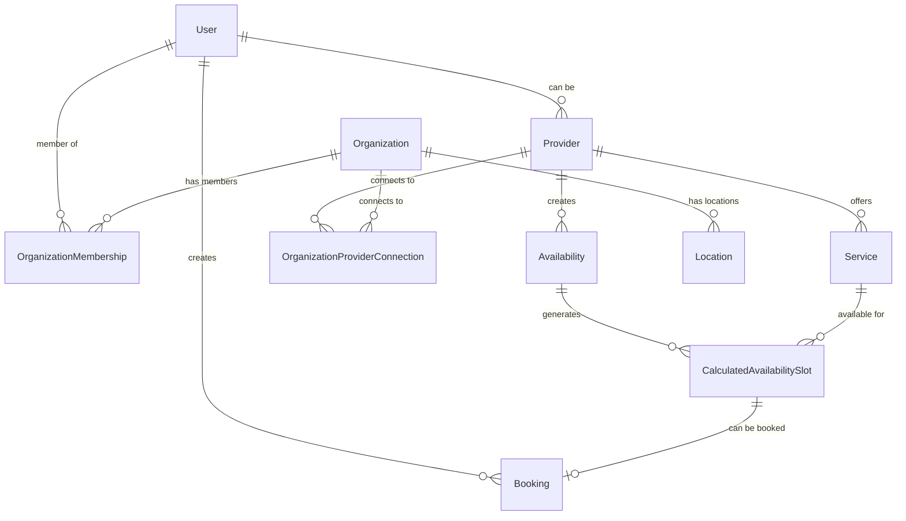
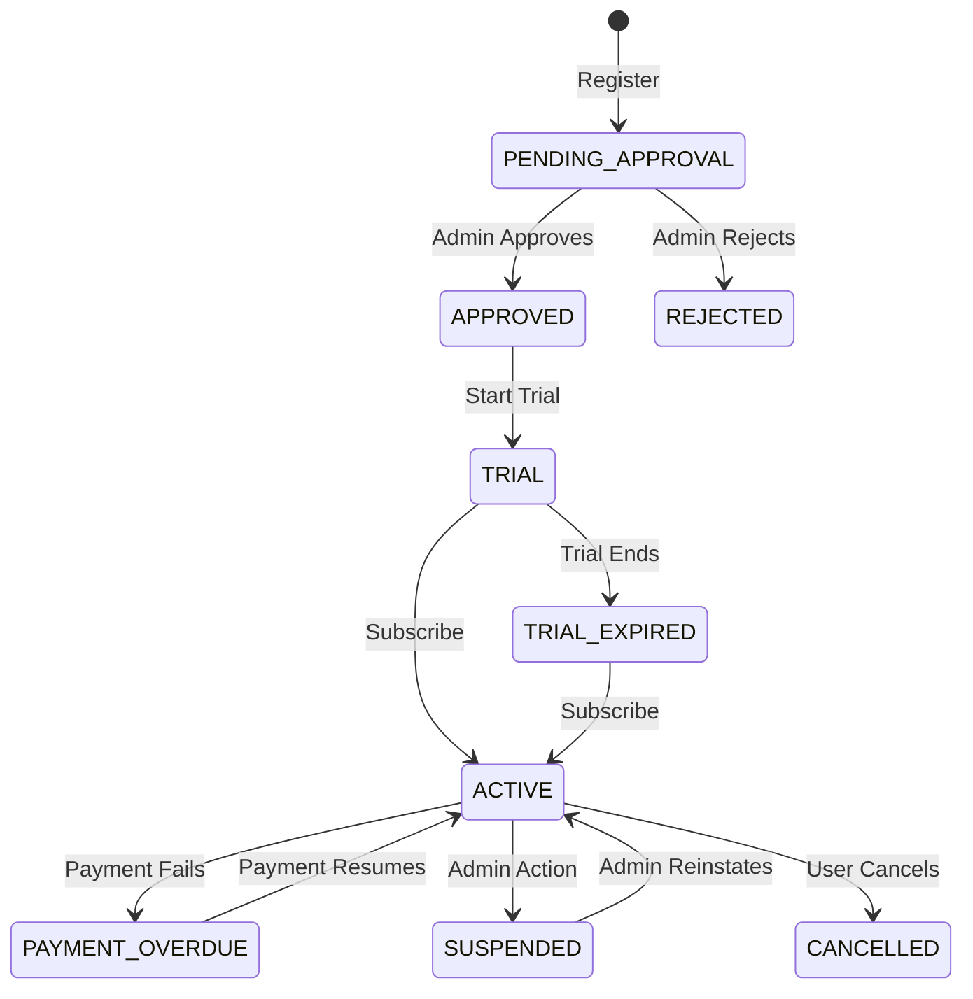

# 🗃️ Prisma Schema Deep Dive

This document explains the complete database schema for MedBookings, including every entity, relationship, business rule, and the reasoning behind the design decisions.

## 📖 What You'll Learn

- **Database Architecture**: Overall schema design and philosophy
- **Entity Relationships**: How all entities connect and why
- **Business Rules**: Constraints and validations built into the schema
- **Enums and Types**: All enumerated values and their meanings
- **Migration Strategy**: How schema changes are managed
- **Query Patterns**: Common database operations and optimizations

## 🎯 Database Architecture Philosophy

### Design Principles

1. **Business-First Design**: Schema reflects business domain, not technical convenience
2. **Referential Integrity**: All relationships properly constrained
3. **Audit Trail**: Track who did what and when
4. **Flexible Status Models**: Support complex workflow states
5. **Performance Optimization**: Strategic indexing for common queries

### Technology Choices

**PostgreSQL** chosen for:
- **ACID Compliance**: Critical for booking systems
- **JSON Support**: Flexible configuration storage
- **Advanced Indexing**: Complex query optimization
- **Concurrent Handling**: Multiple users booking simultaneously

**Prisma ORM** chosen for:
- **Type Safety**: Generated TypeScript types
- **Migration Management**: Version-controlled schema changes  
- **Query Performance**: Optimized SQL generation
- **Developer Experience**: Intuitive query API

## 🏛️ Core Entity Overview



## 👤 User & Authentication System

### User Model
```typescript
model User {
  id                       String    @id @default(cuid())
  name                     String?
  email                    String?   @unique
  emailVerified            DateTime?
  phone                    String?
  phoneVerified            DateTime?
  whatsapp                 String?
  whatsappVerified         DateTime?
  password                 String?   // For future email/password auth
  image                    String?
  role                     UserRole  @default(USER)
  
  // Timestamps
  createdAt                DateTime  @default(now())
  updatedAt                DateTime  @updatedAt
  
  // Relations (every entity a user can be related to)
  accounts                 Account[]                          // OAuth accounts
  provider                 Provider?                          // 1:1 provider profile
  bookingsAsClient         Booking[]          @relation("BookingClient")
  bookingsCreated          Booking[]          @relation("BookingCreator")
  organizationMemberships  OrganizationMembership[]
  availabilitiesCreated    Availability[]                     // Availabilities this user created
  // ... more relations
}
```

**Key Design Decisions**:

1. **Flexible Contact Methods**: Email, phone, WhatsApp all optional but verified separately
2. **Role-Based System**: Simple hierarchy (USER → ADMIN → SUPER_ADMIN)
3. **Future-Proof Auth**: Password field for eventual email/password option
4. **Rich Relations**: User connects to everything they can interact with

### User Roles
```typescript
enum UserRole {
  USER        // Basic user - can book appointments, become provider
  ADMIN       // Platform admin - approve providers/organizations
  SUPER_ADMIN // Full platform control
}
```

**Permission Model**:
- **USER**: Book appointments, create provider/organization profiles
- **ADMIN**: Approve/reject providers and organizations, view platform analytics
- **SUPER_ADMIN**: Full system access, manage other admins

## 🏥 Provider System

### Provider Model
```typescript
model Provider {
  id                     String         @id @default(cuid())
  name                   String
  user                   User           @relation(fields: [userId], references: [id])
  userId                 String         @unique  // 1:1 with User
  
  // Profile Information
  bio                    String?        @db.Text
  image                  String         // URL to Vercel Blob storage
  languages              Languages[]    // Array of spoken languages
  website                String?        @db.Text
  email                  String         @default("default@example.com")
  whatsapp               String         @default("+1234567890")
  showPrice              Boolean        @default(true)
  
  // Approval Workflow
  status                 ProviderStatus @default(PENDING_APPROVAL)
  approvedBy             User?          @relation("ProviderApprovals", fields: [approvedById], references: [id])
  approvedById           String?
  approvedAt             DateTime?
  rejectedAt             DateTime?
  rejectionReason        String?        @db.Text
  
  // Business Metrics
  averageRating          Float?
  totalReviews           Int            @default(0)
  
  // Relations
  services               Service[]
  availabilities         Availability[]
  requirementSubmissions RequirementSubmission[]
  typeAssignments        ProviderTypeAssignment[] // Many-to-many with ProviderType
  
  createdAt              DateTime       @default(now())
  updatedAt              DateTime       @updatedAt
}
```

**Business Rules Encoded**:

1. **One Provider Per User**: `userId @unique` enforces 1:1 relationship
2. **Approval Workflow**: Status controls what provider can do
3. **Audit Trail**: Track who approved/rejected and when
4. **Flexible Profile**: Optional bio, website, configurable contact display
5. **Rating System**: Cached metrics for performance

### Provider Status Flow
```typescript
enum ProviderStatus {
  PENDING_APPROVAL  // Initial registration
  REJECTED         // Admin rejected application  
  APPROVED         // Requirements validated, can start trial
  TRIAL           // Free trial period
  TRIAL_EXPIRED   // Trial ended, needs subscription
  ACTIVE          // Paying subscriber, full access
  PAYMENT_OVERDUE // Payment failed, limited access
  SUSPENDED       // Admin action or compliance issue
  CANCELLED       // Account cancelled
}
```



### Provider Types and Services
```typescript
model ProviderType {
  id               String            @id @default(cuid())
  name             String            @unique  // "General Practitioner", "Dentist"
  description      String?
  requirements     RequirementType[] // What documents/info required
  services         Service[]         // What services this type can offer
  typeAssignments  ProviderTypeAssignment[]
}

model ProviderTypeAssignment {
  id                String        @id @default(cuid())
  providerId        String
  providerTypeId    String
  
  provider          Provider      @relation(fields: [providerId], references: [id], onDelete: Cascade)
  providerType      ProviderType  @relation(fields: [providerTypeId], references: [id], onDelete: Cascade)
  
  @@unique([providerId, providerTypeId]) // Prevent duplicates
}
```

**Why Many-to-Many?** Providers can have multiple specializations (e.g., GP + Pediatrics).

## 🏢 Organization System

### Organization Model
```typescript
model Organization {
  id                   String  @id @default(cuid())
  name                 String
  description          String? @db.Text
  email                String?
  phone                String?
  website              String? @db.Text
  logo                 String? // URL to logo in storage
  
  // Approval Workflow (same pattern as Provider)
  status               OrganizationStatus @default(PENDING_APPROVAL)
  approvedById         String?
  approvedBy           User?   @relation("OrganizationApprovals", fields: [approvedById], references: [id])
  approvedAt           DateTime?
  rejectedAt           DateTime?
  rejectionReason      String? @db.Text
  
  // Business Configuration
  billingModel         OrganizationBillingModel @default(CONSOLIDATED)
  
  // Relations
  memberships          OrganizationMembership[]
  locations            Location[]
  providerConnections  OrganizationProviderConnection[]
  invitations          OrganizationInvitation[]
  
  createdAt DateTime @default(now())
  updatedAt DateTime @updatedAt
}
```

### Organization Membership System
```typescript
model OrganizationMembership {
  id             String                   @id @default(cuid())
  organization   Organization             @relation(fields: [organizationId], references: [id], onDelete: Cascade)
  organizationId String
  user           User                     @relation(fields: [userId], references: [id], onDelete: Cascade)
  userId         String
  role           OrganizationRole
  permissions    OrganizationPermission[]
  status         MembershipStatus         @default(ACTIVE)
  
  @@unique([organizationId, userId]) // One membership per user per org
}

enum OrganizationRole {
  OWNER    // Full control, billing responsibility
  ADMIN    // Operational control, manage providers/bookings  
  MANAGER  // Limited admin rights, specific locations/providers
  STAFF    // Basic operational access
}

enum OrganizationPermission {
  MANAGE_PROVIDERS    // Add/remove/edit service providers
  MANAGE_BOOKINGS    // Create/modify/cancel bookings
  MANAGE_LOCATIONS   // Add/edit locations
  MANAGE_STAFF       // Invite/remove staff members
  VIEW_ANALYTICS     // Access reports and analytics
  MANAGE_BILLING     // Access billing and subscription
  RESPOND_TO_MESSAGES // Respond to patient messages
  MANAGE_AVAILABILITY // Set availability for providers
}
```

**Complex Permission Model**:
- **Roles**: Hierarchical (OWNER > ADMIN > MANAGER > STAFF)
- **Permissions**: Granular capabilities  
- **Flexible Assignment**: Role + specific permissions per member

### Organization-Provider Connections
```typescript
model OrganizationProviderConnection {
  id                String          @id @default(cuid())
  organization      Organization    @relation(fields: [organizationId], references: [id])
  organizationId    String
  provider          Provider        @relation(fields: [providerId], references: [id])
  providerId        String
  
  status            ConnectionStatus @default(PENDING)
  defaultBilledBy   BillingEntity   @default(ORGANIZATION)
  
  requestedAt       DateTime  @default(now())
  acceptedAt        DateTime?
  
  @@unique([organizationId, providerId]) // One connection per pair
}

enum ConnectionStatus {
  PENDING   // Organization invited provider
  ACCEPTED  // Provider accepted invitation
  REJECTED  // Provider rejected invitation  
  SUSPENDED // Connection temporarily disabled
}
```

**Business Logic**: Organizations can invite providers to join their network, providers must accept.

## 📅 Calendar & Booking System

### Availability Model
```typescript
model Availability {
  id                String          @id @default(cuid())
  provider          Provider        @relation(fields: [providerId], references: [id])
  providerId        String
  
  // Time Range
  startTime         DateTime
  endTime           DateTime
  
  // Creation Context
  organization      Organization?   @relation(fields: [organizationId], references: [id])
  organizationId    String?
  location          Location?       @relation(fields: [locationId], references: [id])
  locationId        String?
  
  // Who created this availability
  createdBy         User           @relation(fields: [createdById], references: [id])
  createdById       String
  
  // Approval workflow (for org-created availability)
  status            AvailabilityStatus @default(PENDING)
  acceptedBy        User?          @relation("AvailabilityAccepter", fields: [acceptedById], references: [id])
  acceptedById      String?
  acceptedAt        DateTime?
  
  // Configuration
  requiresConfirmation Boolean       @default(true)
  isOnlineAvailable    Boolean       @default(false)
  schedulingRule       SchedulingRule @default(CONTINUOUS)
  
  // Recurrence
  recurrencePattern    Json?          // Flexible recurrence config
  seriesId            String?         // Group recurring instances
  isRecurring         Boolean         @default(false)
  
  // Generated slots
  calculatedSlots     CalculatedAvailabilitySlot[]
  availableServices   ServiceAvailabilityConfig[]
  
  createdAt           DateTime        @default(now())
  updatedAt           DateTime        @updatedAt
  
  @@index([providerId, startTime, endTime])
  @@index([seriesId]) // Efficient recurring availability queries
}
```

**Key Design Features**:

1. **Flexible Creation**: Either provider or organization can create availability
2. **Approval Workflow**: Org-created availability needs provider acceptance
3. **Rich Configuration**: Online/offline, confirmation requirements, scheduling rules
4. **Recurrence Support**: Complex recurring patterns via JSON + series grouping
5. **Performance Optimized**: Indexes for common query patterns

### Calculated Slots System
```typescript
model CalculatedAvailabilitySlot {
  id                     String                    @id @default(cuid())
  availability           Availability              @relation(fields: [availabilityId], references: [id])
  availabilityId         String
  service                Service                   @relation(fields: [serviceId], references: [id])
  serviceId              String
  serviceConfig          ServiceAvailabilityConfig @relation(fields: [serviceConfigId], references: [id])
  serviceConfigId        String
  
  // Time and Status
  startTime              DateTime
  endTime                DateTime
  status                 SlotStatus                @default(AVAILABLE)
  lastCalculated         DateTime                  // When slot was computed
  
  // Booking Relationship
  booking                Booking?                  // One slot = one booking max
  
  // External Calendar Blocking
  blockedByCalendarEvent CalendarEvent?            @relation("BlockedByCalendarEvent", fields: [blockedByEventId], references: [id])
  blockedByEventId       String?
  
  // Version for optimistic locking
  version                Int                       @default(1)
  
  createdAt              DateTime                  @default(now())
  updatedAt              DateTime                  @updatedAt
  
  @@index([availabilityId, serviceId, startTime, status])
  @@index([startTime, status, serviceId]) // Fast slot queries
}

enum SlotStatus {
  AVAILABLE // Can be booked
  BOOKED   // Has a booking
  BLOCKED  // Blocked by break/admin
  INVALID  // Invalidated by other booking
}
```

**Slot Generation Logic**:
1. **Availability** defines time ranges and rules
2. **Services** define what can be offered and duration
3. **Slots** are pre-calculated combinations of availability + service + time
4. **Booking** claims exactly one slot

### Booking Model
```typescript
model Booking {
  id     String                      @id @default(cuid())
  slot   CalculatedAvailabilitySlot? @relation(fields: [slotId], references: [id])
  slotId String?                     @unique // One booking per slot
  
  // Creation Context
  createdBy           User?                    @relation("BookingCreator", fields: [createdById], references: [id])
  createdById         String?                  // Null for guest self-bookings
  createdByMembership OrganizationMembership? @relation("BookedByOrgMember", fields: [createdByMembershipId], references: [id])
  createdByMembershipId String?                // If booked by org staff
  
  // Client Information
  client        User?   @relation("BookingClient", fields: [clientId], references: [id])
  clientId      String? // Null for guest bookings
  guestName     String? // Required for guest bookings
  guestEmail    String?
  guestPhone    String?
  guestWhatsapp String?
  
  // Booking Details
  price      Decimal       @db.Decimal(10, 2)
  isOnline   Boolean
  isInPerson Boolean       @default(false)
  status     BookingStatus @default(PENDING)
  notes      String?       @db.Text
  
  // Integration Details
  meetLink        String? // Google Meet link
  calendarEventId String? // Google Calendar event ID
  
  // Confirmation workflow
  confirmedBy          User?     @relation("BookingConfirmer", fields: [confirmedById], references: [id])
  confirmedById        String?
  confirmedAt          DateTime?
  
  // Version for optimistic locking
  version Int @default(1)
  
  createdAt DateTime @default(now())
  updatedAt DateTime @updatedAt
  
  @@index([slotId, status])
  @@index([clientId, createdAt])
}
```

**Booking Business Rules**:
1. **One Slot = One Booking**: Enforced by unique constraint
2. **Multiple Creator Types**: User, org member, or guest can create
3. **Guest Support**: Full guest booking without account required
4. **Confirmation Workflow**: Optional provider confirmation step
5. **Integration Ready**: Calendar and video meeting support

## 💰 Billing & Subscription System

### Subscription Model
```typescript
model Subscription {
  id String @id @default(cuid())

  // Polymorphic Relations - only one should be set
  organization      Organization?    @relation(fields: [organizationId], references: [id])
  organizationId    String?
  provider          Provider?        @relation(fields: [providerId], references: [id])
  providerId        String?
  location          Location?        @relation(fields: [locationId], references: [id])
  locationId        String?

  // Subscription Details
  status SubscriptionStatus
  type   SubscriptionType     @default(BASE)
  plan   SubscriptionPlan     @relation(fields: [planId], references: [id])
  planId String

  // Lifecycle
  startDate    DateTime
  endDate      DateTime?
  cancelledAt  DateTime?
  cancelReason String?

  // Usage Tracking
  currentMonthSlots Int      @default(0) // Changed from bookings to slots
  billingCycleStart DateTime
  billingCycleEnd   DateTime

  // Stripe Integration
  stripeCustomerId     String?
  stripeSubscriptionId String?

  // Relations
  payments     Payment[]
  usageRecords UsageRecord[]
  
  createdAt DateTime @default(now())
  updatedAt DateTime @updatedAt
}
```

**Billing Strategy**:
1. **Slot-Based Billing**: Charge for availability slots, not bookings
2. **Tiered Pricing**: Base slots + overage tiers
3. **Flexible Assignment**: Org, location, or provider can own subscription
4. **Usage Tracking**: Real-time slot counting for billing

### Tiered Pricing Model
```typescript
model SubscriptionPlan {
  id          String  @id @default(cuid())
  name        String
  description String?

  // Base Pricing
  basePrice     Decimal         @db.Decimal(10, 2) // e.g., R300
  currency      String          @default("ZAR")
  interval      BillingInterval
  includedSlots Int             @default(30) // Free slots in base price
  
  // Tiered Pricing stored as JSON
  tierPricing   Json // { "31-100": 5.00, "101-300": 4.00, "301+": 3.00 }
  
  // Plan Features
  features      Json? // Feature flags and limits
  maxProviders  Int?
  maxLocations  Int?
  
  stripePriceId String?
  isActive      Boolean @default(true)
  
  subscriptions Subscription[]
  
  createdAt DateTime @default(now())
  updatedAt DateTime @updatedAt
}
```

**Example Tier Pricing**:
```json
{
  "31-100": 5.00,   // Slots 31-100 cost R5 each
  "101-300": 4.00,  // Slots 101-300 cost R4 each  
  "301+": 3.00      // Slots 301+ cost R3 each
}
```

## 🛡️ Compliance & Requirements

### Requirement System
```typescript
model RequirementType {
  id                    String                    @id @default(cuid())
  name                  String
  description           String?
  isRequired            Boolean                   @default(true)
  validationType        RequirementValidationType
  validationConfig      Json? // Type-specific config
  displayPriority       Int                       @default(0)
  
  providerType          ProviderType              @relation(fields: [providerTypeId], references: [id])
  providerTypeId        String
  submissions           RequirementSubmission[]
}

enum RequirementValidationType {
  BOOLEAN       // Yes/No checkbox
  DOCUMENT      // File upload required
  TEXT          // Free text input
  DATE          // Date picker
  FUTURE_DATE   // Must be in future (license expiry)
  PAST_DATE     // Must be in past (graduation date)
  NUMBER        // Numeric input
  PREDEFINED_LIST // Dropdown selection
}

model RequirementSubmission {
  id                String                       @id @default(cuid())
  requirementType   RequirementType              @relation(fields: [requirementTypeId], references: [id])
  requirementTypeId String
  provider          Provider                     @relation(fields: [providerId], references: [id])
  providerId        String
  
  status            RequirementsValidationStatus @default(PENDING)
  documentMetadata  Json? // Actual data (file URLs, text, etc.)
  expiresAt         DateTime? // For time-sensitive requirements
  notes             String? // Admin validation notes
  
  validatedAt       DateTime?
  validatedBy       User? @relation("ValidatedBy", fields: [validatedById], references: [id])
  validatedById     String?
  
  @@unique([requirementTypeId, providerId]) // One submission per requirement per provider
}
```

**Flexible Validation System**:
1. **Type-Specific Validation**: Different input types with specific rules
2. **Configuration-Driven**: JSON config for type-specific options
3. **Expiration Support**: Time-sensitive documents (licenses, certifications)
4. **Audit Trail**: Track who validated what and when

## 🔄 Calendar Integration

### Google Calendar Integration
```typescript
model CalendarIntegration {
  id                String          @id @default(cuid())
  provider          Provider        @relation(fields: [providerId], references: [id])
  providerId        String          @unique
  
  // OAuth Details
  calendarProvider  String // "GOOGLE", "OUTLOOK", etc.
  accessToken       String          @db.Text
  refreshToken      String          @db.Text
  expiresAt         DateTime
  grantedScopes     String[] // OAuth scopes granted
  
  // Configuration
  calendarId        String?
  googleEmail       String?
  syncEnabled       Boolean         @default(true)
  syncDirection     CalendarSyncDirection @default(BIDIRECTIONAL)
  
  // Meet Settings
  meetSettings      Json? // Default duration, auto-create, etc.
  autoCreateMeetLinks Boolean         @default(true)
  
  // Sync Management
  lastSyncedAt      DateTime?
  nextSyncToken     String? // For incremental sync
  backgroundSyncEnabled Boolean     @default(true)
  syncIntervalMinutes   Int         @default(15)
  
  // Relations
  calendarEvents    CalendarEvent[]
  syncOperations    CalendarSyncOperation[]
}

model CalendarEvent {
  id                    String              @id @default(cuid())
  calendarIntegration   CalendarIntegration @relation(fields: [calendarIntegrationId], references: [id])
  calendarIntegrationId String

  // External Calendar Details
  externalEventId    String // Google Calendar event ID
  externalCalendarId String // Which calendar
  etag               String? // For change detection
  
  // Event Details
  title     String
  startTime DateTime
  endTime   DateTime
  isAllDay  Boolean  @default(false)
  
  // Sync Status
  lastSyncedAt           DateTime                @default(now())
  syncStatus             CalendarEventSyncStatus @default(SYNCED)
  lastModifiedInExternal DateTime?
  
  // Conflict Management
  hasConflict        Boolean   @default(false)
  conflictDetails    String?   @db.Text
  conflictResolvedAt DateTime?
  
  // Relations - slots blocked by this event
  blockedSlots CalculatedAvailabilitySlot[] @relation("BlockedByCalendarEvent")
  
  @@unique([calendarIntegrationId, externalEventId])
  @@index([calendarIntegrationId, startTime, endTime])
}
```

**Complex Sync System**:
1. **Bidirectional Sync**: MedBookings ↔ Google Calendar
2. **Incremental Updates**: Only sync changes since last sync
3. **Conflict Detection**: Handle conflicting edits gracefully
4. **Background Sync**: Automatic periodic synchronization
5. **Webhook Support**: Real-time update notifications

## 📍 Location System

### Location Model
```typescript
model Location {
  id             String       @id @default(cuid())
  organization   Organization @relation(fields: [organizationId], references: [id], onDelete: Cascade)
  organizationId String

  // Basic Details
  name           String // "Downtown Clinic", "Main Branch"
  
  // Google Maps Integration (source of truth)
  googlePlaceId  String       @unique // Google Places API ID
  formattedAddress String      @db.Text // Full address from Google
  coordinates    Json         // {lat: number, lng: number}
  
  // Search Optimization
  searchTerms    String[]     // Custom search terms
  
  // Contact
  phone          String?
  email          String?
  
  // Relations
  availabilities        Availability[]
  serviceConfigurations ServiceAvailabilityConfig[]
  subscriptions         Subscription[] // For per-location billing
  
  @@index([organizationId])
  @@index([searchTerms]) // Search functionality
}
```

**Location Design Philosophy**:
1. **Google Maps Source of Truth**: Ensures accurate, standardized addresses
2. **Custom Search Terms**: Providers can add terms patients might search for
3. **Flexible Billing**: Locations can have their own subscriptions
4. **Rich Relations**: Locations connect to availability and services

## 📊 Indexing Strategy

### Performance-Critical Indexes

```sql
-- User lookups
CREATE INDEX idx_users_email ON "User"(email);
CREATE INDEX idx_users_role ON "User"(role);

-- Provider queries
CREATE INDEX idx_providers_status ON "Provider"(status);
CREATE INDEX idx_providers_user_id ON "Provider"("userId");

-- Availability searches (most critical for performance)
CREATE INDEX idx_availability_provider_time ON "Availability"("providerId", "startTime", "endTime");
CREATE INDEX idx_availability_status ON "Availability"(status);
CREATE INDEX idx_availability_series ON "Availability"("seriesId");

-- Slot queries (booking system performance)
CREATE INDEX idx_slots_availability_service ON "CalculatedAvailabilitySlot"("availabilityId", "serviceId", "startTime", status);
CREATE INDEX idx_slots_time_status ON "CalculatedAvailabilitySlot"("startTime", status, "serviceId");

-- Booking queries
CREATE INDEX idx_bookings_client ON "Booking"("clientId", "createdAt");
CREATE INDEX idx_bookings_slot_status ON "Booking"("slotId", status);

-- Organization membership lookups
CREATE INDEX idx_org_membership_user ON "OrganizationMembership"("userId");
CREATE INDEX idx_org_membership_org ON "OrganizationMembership"("organizationId");

-- Calendar integration performance
CREATE INDEX idx_calendar_events_time ON "CalendarEvent"("calendarIntegrationId", "startTime", "endTime");
CREATE INDEX idx_calendar_events_sync ON "CalendarEvent"("syncStatus", "hasConflict");
```

### Query Optimization Patterns

```typescript
// Efficient availability search with proper indexes
const availableSlots = await prisma.calculatedAvailabilitySlot.findMany({
  where: {
    startTime: { gte: startDate },
    endTime: { lte: endDate },
    status: 'AVAILABLE',
    availability: {
      providerId: providerId,
      status: 'ACCEPTED'
    }
  },
  include: {
    service: true,
    availability: {
      include: { provider: { include: { user: true } } }
    }
  },
  orderBy: { startTime: 'asc' }
});
// Uses: idx_slots_time_status + idx_availability_provider_time
```

## 🔒 Business Rules Enforcement

### Database-Level Constraints

```sql
-- One provider per user
ALTER TABLE "Provider" ADD CONSTRAINT "Provider_userId_key" UNIQUE ("userId");

-- One booking per slot
ALTER TABLE "Booking" ADD CONSTRAINT "Booking_slotId_key" UNIQUE ("slotId");

-- One membership per user per organization
ALTER TABLE "OrganizationMembership" ADD CONSTRAINT "OrganizationMembership_organizationId_userId_key" 
  UNIQUE ("organizationId", "userId");

-- Prevent duplicate provider type assignments
ALTER TABLE "ProviderTypeAssignment" ADD CONSTRAINT "ProviderTypeAssignment_providerId_providerTypeId_key" 
  UNIQUE ("providerId", "providerTypeId");
```

### Application-Level Business Rules

```typescript
// Example: Provider creation with business logic validation
async function createProvider(data: CreateProviderData, userId: string) {
  // 1. Check for existing provider
  const existingProvider = await prisma.provider.findUnique({
    where: { userId }
  });
  
  if (existingProvider) {
    throw new Error('User already has a provider profile');
  }
  
  // 2. Validate provider type exists and is active
  const providerTypes = await prisma.providerType.findMany({
    where: { id: { in: data.providerTypeIds } }
  });
  
  if (providerTypes.length !== data.providerTypeIds.length) {
    throw new Error('Invalid provider type');
  }
  
  // 3. Create with transaction for consistency
  return await prisma.$transaction(async (tx) => {
    const provider = await tx.provider.create({
      data: {
        ...data,
        userId,
        status: 'PENDING_APPROVAL'
      }
    });
    
    // 4. Create type assignments
    await tx.providerTypeAssignment.createMany({
      data: data.providerTypeIds.map(typeId => ({
        providerId: provider.id,
        providerTypeId: typeId
      }))
    });
    
    // 5. Business logic side effects
    await sendProviderCreatedNotification(provider.id);
    
    return provider;
  });
}
```

## 🚀 Migration Strategy

### Schema Evolution Principles

1. **Backward Compatible**: Never break existing queries
2. **Gradual Rollout**: Migrations can be applied incrementally
3. **Data Integrity**: All migrations preserve data consistency
4. **Performance Aware**: Large migrations consider index rebuilding

### Example Migration Pattern
```typescript
// prisma/migrations/20240101000000_add_provider_trial_status/migration.sql

-- 1. Add new enum value (safe - expands options)
ALTER TYPE "ProviderStatus" ADD VALUE 'TRIAL_EXPIRED';

-- 2. Add new columns with defaults (safe - doesn't break existing queries)
ALTER TABLE "Provider" ADD COLUMN "trialStarted" TIMESTAMP(3);
ALTER TABLE "Provider" ADD COLUMN "trialEnded" TIMESTAMP(3);
ALTER TABLE "Provider" ADD COLUMN "trialStatus" "TrialStatus";

-- 3. Create new enum type
CREATE TYPE "TrialStatus" AS ENUM ('NOT_STARTED', 'ACTIVE', 'EXPIRING_SOON', 'EXPIRED', 'CONVERTED');

-- 4. Update existing data (careful - may be slow on large tables)
UPDATE "Provider" SET "trialStatus" = 'NOT_STARTED' WHERE "trialStatus" IS NULL;

-- 5. Add new indexes (can be done concurrently)
CREATE INDEX CONCURRENTLY "Provider_trialStatus_idx" ON "Provider"("trialStatus");

-- 6. Add constraints after data migration
ALTER TABLE "Provider" ALTER COLUMN "trialStatus" SET DEFAULT 'NOT_STARTED';
```

## 🎯 Best Practices Summary

### Schema Design
1. **Business-First**: Model the business domain accurately
2. **Referential Integrity**: Use foreign keys and constraints
3. **Audit Trails**: Track who, what, when for critical operations
4. **Flexible Enums**: Plan for status evolution

### Performance
1. **Strategic Indexing**: Index common query patterns
2. **Query Optimization**: Use indexes effectively
3. **Pagination**: Always paginate large result sets
4. **Caching**: Cache expensive computed values

### Data Integrity
1. **Transactions**: Use for multi-step operations
2. **Validation**: Validate at multiple levels (DB, app, UI)
3. **Constraints**: Enforce business rules at DB level
4. **Testing**: Test migrations and business logic

### Evolution
1. **Migration Safety**: Always backward compatible
2. **Gradual Rollout**: Phase complex changes
3. **Monitoring**: Track migration performance
4. **Rollback Plans**: Have rollback strategies

## 🔗 Related Documentation

- [Core Architecture Overview](../core/architecture-overview.md) - System design patterns
- [Data Flow Patterns](../core/data-flow-patterns.md) - How data moves through the system
- [tRPC Architecture](../api/trpc-architecture.md) - API layer integration
- [Feature Module Pattern](../features/feature-module-pattern.md) - Business logic organization

---

*This database schema represents a carefully designed system that balances business requirements, performance needs, and future scalability while maintaining data integrity and providing rich functionality for the MedBookings platform.*