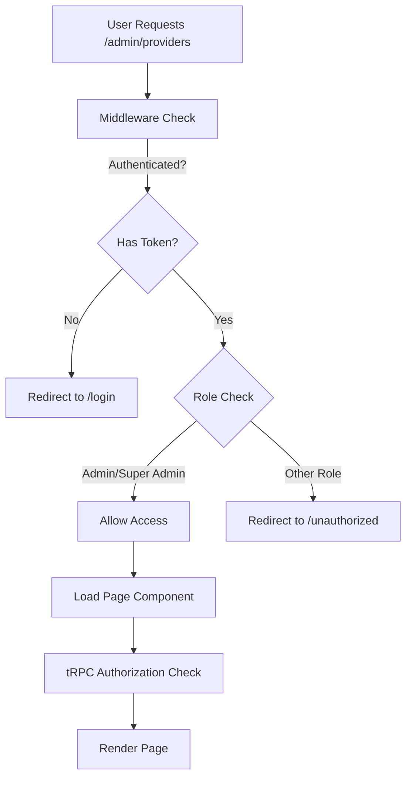
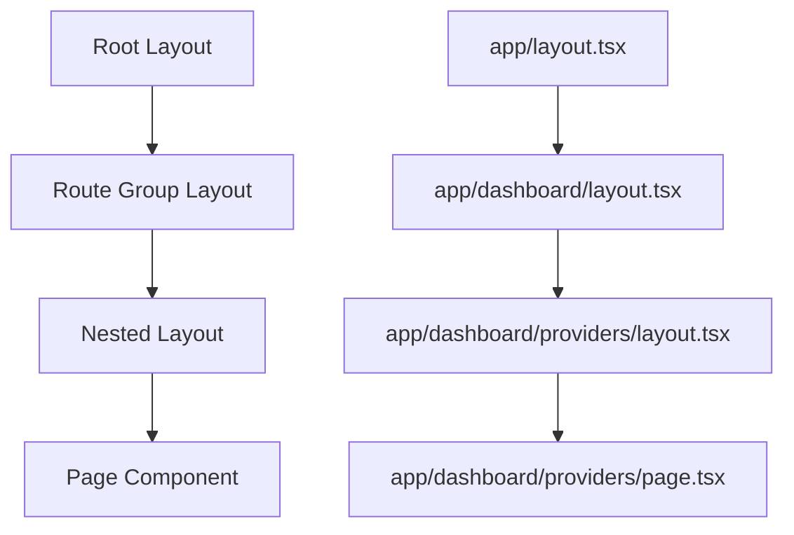

# 🚀 Next.js App Router Architecture

This document explains how MedBookings uses Next.js 14's App Router for routing, layouts, and page organization. Understanding this architecture is crucial for adding new pages or modifying existing routes.

## 📖 What You'll Learn

- **App Router Fundamentals**: How Next.js App Router works
- **Route Groups Strategy**: How routes are organized and protected
- **Layout System**: Shared layouts and composition patterns
- **Page Components**: Server vs client components for pages
- **Navigation Patterns**: How users move through the application
- **Middleware Integration**: Authentication and authorization

## 🗂️ App Directory Structure

```
src/app/
├── 📁 (dashboard)/              # Route Group - Protected Routes
│   ├── layout.tsx              # Dashboard layout wrapper
│   ├── loading.tsx             # Loading UI for dashboard
│   ├── 📁 admin/               # Admin-only pages
│   ├── 📁 availability/        # Availability management
│   ├── 📁 organizations/       # Organization management
│   ├── 📁 profile/             # User profile
│   └── 📁 providers/           # Provider management
│
├── 📁 (general)/               # Route Group - Public Routes
│   ├── layout.tsx              # Public layout wrapper
│   ├── 📁 (auth)/              # Authentication pages
│   ├── 📁 (compliance)/        # Legal pages
│   ├── 📁 calendar/            # Public booking interface
│   ├── 📁 invitation/          # Invitation handling
│   ├── 📁 join-medbookings/    # Registration flow
│   ├── 📁 unauthorized/        # Access denied page
│   └── page.tsx                # Homepage (/)
│
├── 📁 api/                     # API Routes
│   ├── 📁 auth/                # NextAuth.js endpoints
│   ├── 📁 trpc/                # tRPC API handler
│   ├── 📁 upload/              # File upload endpoints
│   └── 📁 whatsapp-callback/   # Webhook handlers
│
├── favicon.ico                 # Site favicon
├── globals.css                 # Global styles
├── layout.tsx                  # Root layout (all pages)
├── loading.tsx                 # Global loading UI
└── not-found.tsx               # 404 error page
```

## 🎯 Route Groups Explained

### What are Route Groups?

Route Groups use parentheses `(name)` to organize routes without affecting the URL structure.

**Example**:
- File: `app/(dashboard)/providers/page.tsx`
- URL: `/providers` (NOT `/dashboard/providers`)

### Why Two Route Groups?

**`(dashboard)` Group - Protected Routes**:
- **Purpose**: Authenticated user pages
- **Layout**: Dashboard with sidebar navigation
- **Middleware**: Authentication required
- **Users**: Logged-in users (patients, providers, admins)

**`(general)` Group - Public Routes**:
- **Purpose**: Public access pages
- **Layout**: Clean public layout with header/footer
- **Middleware**: No authentication required
- **Users**: Anyone (including non-registered users)

### Route Group Benefits

```typescript
// Different layouts for different route groups
// app/(dashboard)/layout.tsx
export default function DashboardLayout({ children }: { children: ReactNode }) {
  return (
    <div className="flex min-h-screen">
      <AppSidebar />              {/* Dashboard navigation */}
      <main className="flex-1">
        {children}
      </main>
    </div>
  );
}

// app/(general)/layout.tsx  
export default function GeneralLayout({ children }: { children: ReactNode }) {
  return (
    <div className="min-h-screen">
      <Header />                  {/* Public header */}
      <main>
        {children}
      </main>
      <Footer />                  {/* Public footer */}
    </div>
  );
}
```

## 🔒 Authentication and Route Protection

### Middleware-Based Protection

```typescript
// middleware.ts - Route protection
export const config = {
  matcher: [
    '/dashboard/:path*',    // All dashboard routes
    '/admin/:path*',        // All admin routes  
    '/profile/:path*',      // Profile routes
    '/organizations/:path*', // Organization routes
    '/providers/:path*',    // Provider routes
    '/availability/:path*'  // Availability routes
  ],
};

export default withAuth(
  async (req: NextRequest) => {
    const token = await getToken({ req });
    const { pathname } = req.nextUrl;
    
    // Redirect unauthenticated users
    if (!token) {
      return NextResponse.redirect(new URL('/login', req.url));
    }
    
    // Role-based access control
    if (pathname.startsWith('/admin')) {
      if (!['ADMIN', 'SUPER_ADMIN'].includes(token.role)) {
        return NextResponse.redirect(new URL('/unauthorized', req.url));
      }
    }
    
    return NextResponse.next();
  }
);
```

### Protection Layers



## 📄 Page Component Patterns

### Server Component Pages (Default)

```typescript
// app/(dashboard)/providers/page.tsx - Server Component
import { getProviders } from '@/lib/queries';
import { ProvidersList } from '@/features/providers';

export default async function ProvidersPage() {
  // Data fetching on server
  const providers = await getProviders();
  
  return (
    <div>
      <h1>Providers</h1>
      <ProvidersList initialData={providers} />
    </div>
  );
}

// Automatic static metadata generation
export const metadata: Metadata = {
  title: 'Providers | MedBookings',
  description: 'Manage healthcare providers',
};
```

### Dynamic Pages with Params

```typescript
// app/(dashboard)/providers/[id]/page.tsx
import { notFound } from 'next/navigation';
import { getProvider } from '@/lib/queries';
import { ProviderDetail } from '@/features/providers';

interface PageProps {
  params: { id: string };
  searchParams: { [key: string]: string | string[] | undefined };
}

export default async function ProviderDetailPage({ params }: PageProps) {
  const provider = await getProvider(params.id);
  
  // Handle not found case
  if (!provider) {
    notFound(); // Triggers not-found.tsx
  }
  
  return (
    <div>
      <h1>{provider.name}</h1>
      <ProviderDetail provider={provider} />
    </div>
  );
}

// Dynamic metadata generation
export async function generateMetadata({ params }: PageProps): Promise<Metadata> {
  const provider = await getProvider(params.id);
  
  return {
    title: `${provider?.name || 'Provider'} | MedBookings`,
    description: provider?.bio || 'Healthcare provider profile',
  };
}
```

### Client Component Pages

```typescript
// app/(general)/calendar/[id]/page.tsx - When interactivity is needed
'use client';

import { useEffect, useState } from 'react';
import { useRouter } from 'next/navigation';
import { BookingCalendar } from '@/features/calendar';

export default function BookingPage({ params }: { params: { id: string } }) {
  const router = useRouter();
  const [selectedDate, setSelectedDate] = useState<Date | null>(null);
  
  useEffect(() => {
    // Client-side logic
  }, []);
  
  return (
    <div>
      <BookingCalendar 
        providerId={params.id}
        selectedDate={selectedDate}
        onDateSelect={setSelectedDate}
      />
    </div>
  );
}
```

## 🎨 Layout System

### Layout Hierarchy



### Root Layout (All Pages)

```typescript
// app/layout.tsx - Applied to ALL pages
import { Providers } from '@/components/providers';
import { Toaster } from '@/components/ui/toaster';
import './globals.css';

export default function RootLayout({
  children,
}: {
  children: React.ReactNode;
}) {
  return (
    <html lang="en" suppressHydrationWarning>
      <body className="antialiased">
        <Providers>          {/* React Query, Auth, Theme providers */}
          {children}
        </Providers>
        <Toaster />         {/* Global toast notifications */}
      </body>
    </html>
  );
}
```

### Dashboard Layout

```typescript
// app/(dashboard)/layout.tsx
import { DashboardLayout } from '@/components/layout/dashboard-layout';

export default function Layout({ children }: { children: React.ReactNode }) {
  return <DashboardLayout>{children}</DashboardLayout>;
}

// components/layout/dashboard-layout.tsx
export function DashboardLayout({ children }: { children: ReactNode }) {
  return (
    <div className="flex min-h-screen">
      <AppSidebar />                    {/* Navigation sidebar */}
      
      <main className="flex-1 flex flex-col">
        <DashboardHeader />             {/* Header with user menu */}
        
        <div className="flex-1 p-6">
          <Suspense fallback={<Loading />}>
            {children}                  {/* Page content */}
          </Suspense>
        </div>
      </main>
    </div>
  );
}
```

### Nested Layouts

```typescript
// app/(dashboard)/providers/layout.tsx - Additional layout for provider section
import { ProvidersNavigation } from '@/features/providers';

export default function ProvidersLayout({
  children,
}: {
  children: React.ReactNode;
}) {
  return (
    <div className="space-y-6">
      <ProvidersNavigation />           {/* Provider-specific navigation */}
      {children}
    </div>
  );
}
```

## 🔄 Loading and Error Handling

### Loading States

```typescript
// app/(dashboard)/providers/loading.tsx - Route-level loading
import { ProviderSkeleton } from '@/components/skeletons';

export default function Loading() {
  return (
    <div>
      <h1>Providers</h1>
      <ProviderSkeleton count={6} />
    </div>
  );
}

// app/(dashboard)/providers/[id]/loading.tsx - Specific loading for provider detail
export default function Loading() {
  return <ProviderDetailSkeleton />;
}
```

### Error Boundaries

```typescript
// app/(dashboard)/providers/error.tsx
'use client';

import { useEffect } from 'react';
import { Button } from '@/components/ui/button';

export default function Error({
  error,
  reset,
}: {
  error: Error & { digest?: string };
  reset: () => void;
}) {
  useEffect(() => {
    // Log error to monitoring service
    console.error('Providers page error:', error);
  }, [error]);

  return (
    <div className="flex flex-col items-center justify-center min-h-[400px] space-y-4">
      <h2 className="text-lg font-semibold">Something went wrong!</h2>
      <p className="text-muted-foreground text-center max-w-md">
        We encountered an error while loading the providers. Please try again.
      </p>
      <Button onClick={reset}>
        Try again
      </Button>
    </div>
  );
}
```

### Global Not Found

```typescript
// app/not-found.tsx - Global 404 page
import Link from 'next/link';
import { Button } from '@/components/ui/button';

export default function NotFound() {
  return (
    <div className="flex flex-col items-center justify-center min-h-screen space-y-4">
      <h1 className="text-4xl font-bold">404</h1>
      <h2 className="text-xl font-semibold">Page Not Found</h2>
      <p className="text-muted-foreground">
        The page you're looking for doesn't exist.
      </p>
      <Button asChild>
        <Link href="/">
          Go Home
        </Link>
      </Button>
    </div>
  );
}
```

## 🧭 Navigation Patterns

### Programmatic Navigation

```typescript
'use client';

import { useRouter, useSearchParams } from 'next/navigation';

function NavigationExample() {
  const router = useRouter();
  const searchParams = useSearchParams();
  
  const handleNavigation = () => {
    // Navigate to provider detail
    router.push('/providers/123');
    
    // Navigate with query params
    router.push('/providers/123?tab=services');
    
    // Replace current entry
    router.replace('/providers/123');
    
    // Go back
    router.back();
  };
  
  // Read current search params
  const activeTab = searchParams.get('tab') || 'details';
  
  return (
    <div>
      <button onClick={handleNavigation}>
        Navigate to Provider
      </button>
    </div>
  );
}
```

### Link Components

```typescript
import Link from 'next/link';

function NavigationLinks() {
  return (
    <nav>
      {/* Simple link */}
      <Link href="/providers" className="nav-link">
        Providers
      </Link>
      
      {/* Dynamic link */}
      <Link href={`/providers/${provider.id}`} className="nav-link">
        {provider.name}
      </Link>
      
      {/* Link with prefetching disabled */}
      <Link href="/heavy-page" prefetch={false}>
        Heavy Page
      </Link>
      
      {/* External link */}
      <Link href="https://external.com" target="_blank" rel="noopener">
        External Link
      </Link>
    </nav>
  );
}
```

## 🗃️ Route Organization Patterns

### Feature-Based Routing

**Organization Routes**:
```
app/(dashboard)/organizations/
├── page.tsx                      # /organizations (list)
├── loading.tsx                   # Loading state
├── [id]/
│   ├── page.tsx                  # /organizations/[id] (detail)
│   ├── loading.tsx               # Detail loading
│   ├── edit/
│   │   ├── page.tsx              # /organizations/[id]/edit
│   │   ├── basic-info/
│   │   │   └── page.tsx          # /organizations/[id]/edit/basic-info
│   │   ├── billing/
│   │   │   └── page.tsx          # /organizations/[id]/edit/billing
│   │   └── locations/
│   │       └── page.tsx          # /organizations/[id]/edit/locations
│   ├── members/
│   │   └── page.tsx              # /organizations/[id]/members
│   ├── manage-calendar/
│   │   └── page.tsx              # /organizations/[id]/manage-calendar
│   └── view-calendar/
│       └── page.tsx              # /organizations/[id]/view-calendar
└── new/
    ├── page.tsx                  # /organizations/new
    └── loading.tsx               # New organization loading
```

### API Route Organization

```
app/api/
├── auth/                         # NextAuth.js endpoints
│   └── [...nextauth]/
│       └── route.ts              # /api/auth/* (Google OAuth)
├── trpc/
│   └── [trpc]/
│       └── route.ts              # /api/trpc/* (tRPC handler)
├── upload/
│   └── route.ts                  # /api/upload (file uploads)
└── whatsapp-callback/
    └── route.ts                  # /api/whatsapp-callback (webhooks)
```

### Special Files

| File | Purpose | Example |
|------|---------|---------|
| `page.tsx` | Page component | Main content for route |
| `layout.tsx` | Shared layout | Navigation, headers, footers |
| `loading.tsx` | Loading UI | Skeleton components |
| `error.tsx` | Error boundary | Error handling UI |
| `not-found.tsx` | 404 page | Route not found handling |
| `route.ts` | API endpoint | REST API handlers |

## ⚡ Performance Optimization

### Route-Level Code Splitting

```typescript
// Automatic code splitting by route
// Each page.tsx is automatically split into its own chunk

// Dynamic imports for heavy components
const HeavyComponent = lazy(() => import('@/components/heavy-component'));

function PageWithHeavyComponent() {
  return (
    <div>
      <Suspense fallback={<Loading />}>
        <HeavyComponent />
      </Suspense>
    </div>
  );
}
```

### Prefetching Strategy

```typescript
// Next.js automatically prefetches visible Link components
function OptimizedNavigation() {
  return (
    <nav>
      {/* Automatically prefetched on hover/viewport */}
      <Link href="/providers" prefetch>
        Providers
      </Link>
      
      {/* Disabled prefetching for heavy pages */}
      <Link href="/analytics" prefetch={false}>
        Analytics
      </Link>
    </nav>
  );
}
```

### Static Generation

```typescript
// For public pages that can be statically generated
export async function generateStaticParams() {
  const providers = await getPublicProviders();
  
  return providers.map((provider) => ({
    id: provider.id,
  }));
}

// Incremental Static Regeneration
export const revalidate = 3600; // Revalidate every hour
```

## 🎯 Best Practices Summary

### Route Organization
1. **Use Route Groups**: Organize by user type and layout needs
2. **Feature-Based Structure**: Group related pages together
3. **Consistent Naming**: Follow Next.js conventions
4. **Nested Layouts**: Compose layouts for specific sections

### Page Components
1. **Server Components First**: Use server components by default
2. **Client When Needed**: Only for interactivity
3. **Proper Loading States**: Provide good UX during loading
4. **Error Boundaries**: Handle errors gracefully

### Performance
1. **Route-Level Splitting**: Automatic code splitting
2. **Strategic Prefetching**: Prefetch important routes
3. **Lazy Loading**: Dynamic imports for heavy components
4. **Static Generation**: For public content

### Security
1. **Middleware Protection**: Route-level authentication
2. **Role-Based Access**: Proper authorization
3. **API Authorization**: Double-check permissions
4. **Error Handling**: Don't leak sensitive information

## 🔗 Related Documentation

- [Core Architecture Overview](../core/architecture-overview.md) - System design patterns
- [Project Structure Deep Dive](../core/project-structure-explained.md) - Folder organization
- [Component Patterns](../components/component-patterns.md) - UI component architecture
- [Authentication Feature](../features/auth-feature.md) - Authentication implementation

---

*This App Router architecture provides a scalable, maintainable routing system that grows with the MedBookings platform while maintaining excellent developer experience and performance.*