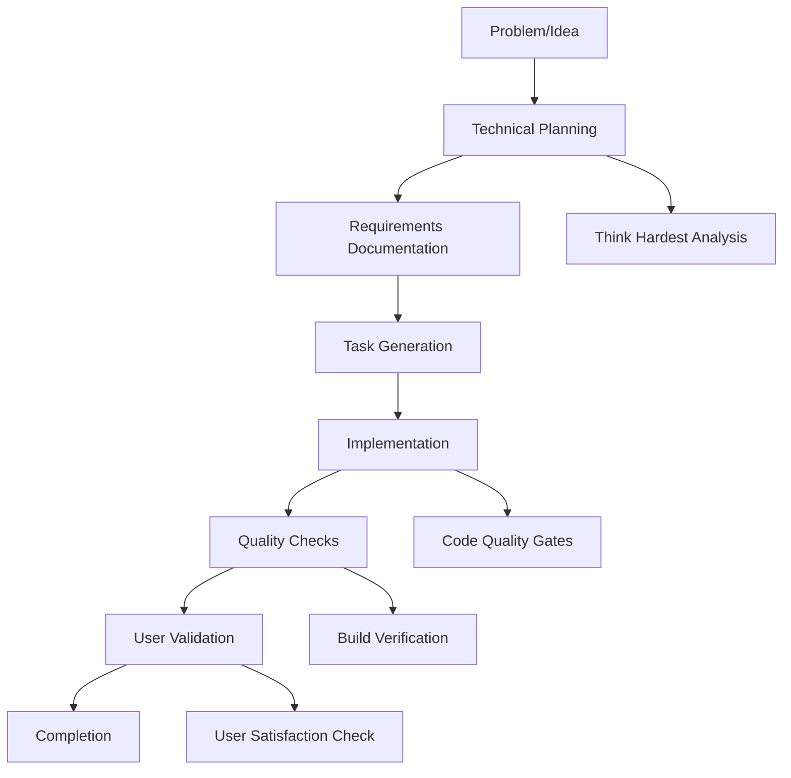
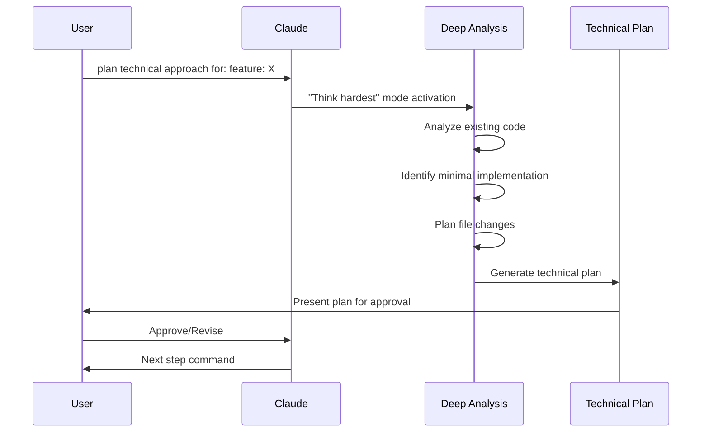
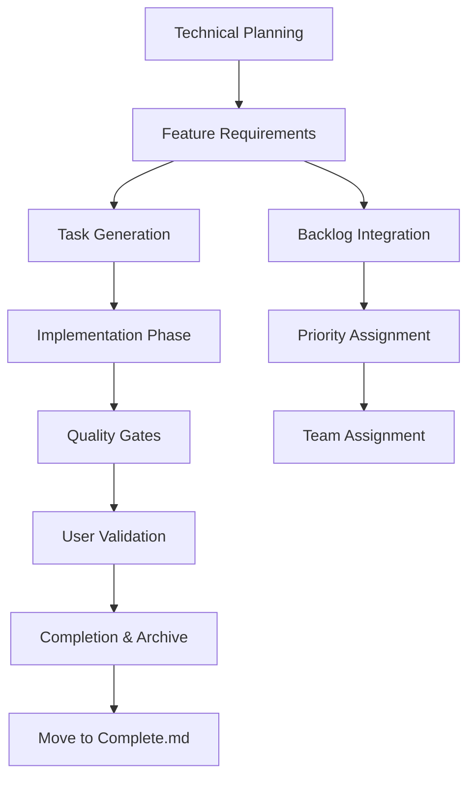
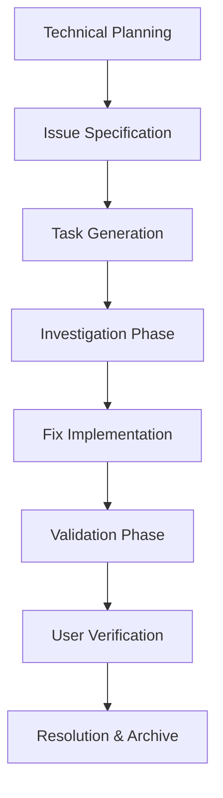
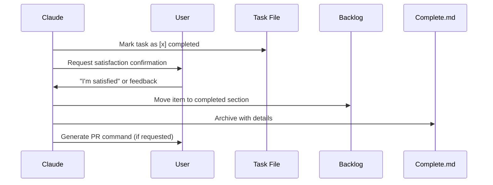

# ⚡ Development Workflow System

This document explains the comprehensive development workflow system used in MedBookings, including technical planning, feature development, issue resolution, and task management processes.

## 📖 What You'll Learn

- **Workflow System Overview**: Complete development lifecycle management
- **Technical Planning Process**: Deep technical analysis before implementation
- **Feature Development Flow**: From idea to implementation
- **Issue Resolution Process**: Systematic problem-solving approach
- **Task Management**: Structured task tracking and completion
- **Quality Assurance**: Built-in quality gates and checks

## 🎯 Workflow System Philosophy

The MedBookings workflow system follows a **structured, quality-first approach** where every change goes through proper analysis, planning, and validation phases.

### Core Principles

1. **Technical Planning First**: Always analyze before implementing
2. **Think Hardest Mode**: Deep cognitive effort for complex problems
3. **Minimal Implementation**: Build only what's needed now
4. **Quality Gates**: Linting, compilation, and testing at each step
5. **User Satisfaction**: Completion only after user confirms quality

### Workflow Architecture



## 🧠 Technical Planning System

### Entry Point: Technical Analysis

**All features and issues start with technical planning:**

```bash
# Feature planning
plan technical approach for: feature: user-authentication-system

# Issue planning  
plan technical approach for: issue: calendar-sync-conflicts
```

### Technical Planning Process



### Technical Plan Structure

```markdown
# Technical Plan: [Name]

## Type: [Feature/Issue]

## Executive Summary
[2-3 sentences describing the minimal solution approach]

## Scope Definition
### What We're Building
- [Essential functionality only]
- [No legacy fallback unless explicitly requested]

### What We're NOT Building  
- [Future features]
- [Backwards compatibility unless required]
- [Nice-to-haves]

## Technical Architecture
### Files to Modify
/src/[path/file.ts] - [Specific changes needed]

### Files to Create
/src/[path/new-file.ts] - [Purpose and contents]

### Database Changes
- [Schema modifications if any]
- [Migration requirements]

## Implementation Details
### Core Functions
```typescript
// Function: functionName
// Purpose: [1-3 sentences about what it does]
// Location: /src/[path]
functionName(params: Types): ReturnType
```

### API Endpoints (if applicable)
```typescript
// tRPC Procedure: procedureName
// Purpose: [What it does]
// Input: [Schema description]  
// Output: [Return type]
```

## Test Coverage Strategy
### Unit Tests
- should [behavior] - [5-10 words about test]
- handles [edge case] - [5-10 words about test]

### Integration Tests  
- API: [endpoint] returns [data] - [What to verify]
- Database: [operation] persists correctly - [What to check]

### E2E Tests
- User can [action] - [User flow to test]

## Implementation Sequence
1. Phase 1: Foundation
   - [First thing to implement]
   - [Test to write]

2. Phase 2: Core Logic
   - [Implementation step]  
   - [Test to write]

3. Phase 3: Integration
   - [Final connections]
   - [Integration tests]

## Risk Assessment
- Technical Risk: [Any identified risks]
- Performance Impact: [Expected impact]
- Breaking Changes: [Any breaking changes]

## Code Quality Requirements
[ ] No legacy fallback code
[ ] Minimal implementation only
[ ] Each code block must pass linting
[ ] Each code block must compile
[ ] Tests written before next code block
[ ] No backwards compatibility unless requested
```

## 🚀 Feature Development Flow

### Complete Feature Lifecycle



### Step 1: Technical Planning

```bash
# Start with technical analysis
plan technical approach for: feature: provider-calendar-integration

# Output: Technical plan with implementation strategy
# Location: /workflow/technical-plans/provider-calendar-integration-technical-plan.md
```

### Step 2: Feature Requirements

```bash  
# Generate detailed requirements based on technical plan
feature required: provider-calendar-integration

# Creates:
# - /workflow/prds/provider-calendar-integration-prd.md
# - /workflow/prds/provider-calendar-integration-prd-tasks.md  
# - Automatic backlog.md entry
```

**PRD Structure Generated**:
```markdown
# Feature PRD: Provider Calendar Integration

## Executive Summary
[Based on technical plan findings]

## Problem Statement  
[From user research and technical analysis]

## Target Users
- **Primary**: Healthcare providers
- **Secondary**: Organization administrators

## Goals and Success Criteria
- [ ] Providers can sync with Google Calendar
- [ ] Automatic availability blocking for external events
- [ ] Bi-directional synchronization

## Technical Plan Reference
Technical analysis and implementation strategy: 
`/workflow/technical-plans/provider-calendar-integration-technical-plan.md`

## User Stories
1. As a provider, I want to sync my Google Calendar...
2. As a provider, I want external events to block availability...

## Implementation Approach  
[Derived from technical plan with business context]

## Testing Requirements
[From technical plan test coverage strategy]

## Timeline
- Phase 1: [Foundation] - 2 days
- Phase 2: [Core Logic] - 3 days  
- Phase 3: [Integration] - 2 days

## Risks and Mitigation
[From technical plan risk assessment]
```

### Step 3: Task Generation

**Automatic Task Generation from PRD**:
```markdown  
# Implementation Tasks: Provider Calendar Integration

## Phase 1: Foundation [ ]
- [ ] Set up Google Calendar API integration
- [ ] Create calendar OAuth flow
- [ ] Implement token refresh mechanism
- [ ] Write unit tests for OAuth flow

## Phase 2: Core Logic [ ]  
- [ ] Implement calendar event sync
- [ ] Create availability blocking logic
- [ ] Add conflict detection system
- [ ] Write integration tests

## Phase 3: Integration [ ]
- [ ] Integrate with existing availability system
- [ ] Add UI components for calendar settings  
- [ ] Implement error handling and user feedback
- [ ] Write E2E tests for full flow

## Quality Gates
- [ ] All code passes ESLint
- [ ] TypeScript compilation successful  
- [ ] Unit tests achieve 90% coverage
- [ ] Integration tests pass
- [ ] E2E tests pass
- [ ] Build process successful
```

### Step 4: Implementation

```bash
# Execute the planned implementation
implement feature tasks from: provider-calendar-integration-prd-tasks.md

# With optional YOLO mode for continuous execution
implement feature tasks from: provider-calendar-integration-prd-tasks.md yolo mode
```

**Implementation Process**:
1. **Create Feature Branch**: `feature/provider-calendar-integration`
2. **Execute Tasks Sequentially**: Each task with quality gates
3. **Real-time Progress Tracking**: Tasks marked as completed
4. **User Confirmation**: Each milestone confirmed before proceeding
5. **Quality Verification**: Linting, compilation, tests at each step

## 🐛 Issue Resolution Flow

### Complete Issue Lifecycle



### Step 1: Technical Issue Analysis

```bash
# Deep technical analysis of the issue
plan technical approach for: issue: calendar-sync-causing-duplicate-bookings

# Output: Technical plan with root cause analysis
# Location: /workflow/technical-plans/calendar-sync-causing-duplicate-bookings-technical-plan.md
```

### Step 2: Issue Specification

```bash
# Generate detailed issue specification
issue fix required: calendar-sync-causing-duplicate-bookings

# Creates:  
# - /workflow/issues/calendar-sync-causing-duplicate-bookings-issue.md
# - /workflow/issues/calendar-sync-causing-duplicate-bookings-issue-tasks.md
# - Automatic backlog.md entry with severity
```

**Issue Specification Structure**:
```markdown
# Issue Specification: Calendar Sync Causing Duplicate Bookings

## Problem Description
[Detailed description of the unexpected behavior]

## Expected Behavior  
[What should happen instead]

## Reproduction Steps
1. Step 1: [Exact steps to reproduce]
2. Step 2: [Include data/conditions]
3. Step 3: [Expected vs actual result]

## Error Information
```
[Stack trace, error messages, logs]
```

## Environment & Frequency
- **Frequency**: Always/Sometimes/Rarely
- **Browser**: Chrome, Firefox, Safari
- **User Impact**: [How many users affected]
- **First Appeared**: [When issue started]

## Technical Plan Reference  
Root cause analysis and fix strategy:
`/workflow/technical-plans/calendar-sync-causing-duplicate-bookings-technical-plan.md`

## Resolution Approach
[Based on technical plan findings]

## Related Code/Files
[Identified in technical analysis]

## Impact Assessment
- **User Impact**: [Critical/High/Medium/Low]
- **Business Impact**: [Revenue, reputation, operations]
- **Technical Impact**: [Performance, security, data integrity]

## Testing Requirements  
[How to verify the fix works]
```

### Step 3: Issue Resolution Implementation

```bash
# Execute planned issue resolution
implement issue tasks from: calendar-sync-causing-duplicate-bookings-issue-tasks.md
```

**Issue Resolution Task Structure**:
```markdown
# Resolution Tasks: Calendar Sync Duplicate Bookings

## Investigation Phase [ ]
- [ ] Reproduce issue in development environment
- [ ] Analyze database state during sync
- [ ] Identify race condition in booking creation
- [ ] Document root cause findings

## Fix Implementation [ ]
- [ ] Implement optimistic locking for booking creation
- [ ] Add transaction isolation for calendar sync
- [ ] Update sync conflict resolution logic
- [ ] Add comprehensive error handling

## Validation Phase [ ]  
- [ ] Write regression tests for identified bug
- [ ] Verify fix resolves original issue
- [ ] Test edge cases and boundary conditions
- [ ] Performance testing for fix impact

## Quality Gates
- [ ] Fix passes all existing tests
- [ ] New tests added for regression prevention
- [ ] Code review completed
- [ ] Build verification successful
- [ ] User acceptance testing passed
```

## 📋 Task Management System

### Backlog Organization

```markdown
# /workflow/backlog.md - Central task tracking

## Statistics (Auto-Updated)
**Total Items:** 47
**High Priority:** 12  
**Medium Priority:** 18
**Low Priority:** 8
**Completed:** 156
**Last Updated:** 2024-01-15

## High Priority Features
- [ ] [Feature: provider-calendar-integration] - Sync provider calendars with Google Calendar
  - **Type:** Feature
  - **Impact:** Reduces double-booking incidents by 85%
  - **PRD:** `/workflow/prds/provider-calendar-integration-prd.md`
  - **Tasks:** `/workflow/prds/provider-calendar-integration-prd-tasks.md` 
  - **Added:** 2024-01-10

## High Priority Issues
- [ ] [Issue: calendar-sync-duplicate-bookings] - Calendar sync creating duplicate booking slots  
  - **Type:** Bug Fix
  - **Severity:** Critical  
  - **Spec:** `/workflow/issues/calendar-sync-duplicate-bookings-issue.md`
  - **Tasks:** `/workflow/issues/calendar-sync-duplicate-bookings-issue-tasks.md`
  - **Added:** 2024-01-12

## Quick Feature Notes  
- Provider multi-location support
- Advanced availability rules
- Patient notification preferences

## Quick Issue Notes
- Mobile app calendar display issues
- Email notification delivery delays  
- Search performance on large provider lists
```

### Task Execution Patterns

**Interactive Mode (Default)**:
```bash
implement feature tasks from: provider-calendar-integration-prd-tasks.md

# Process:
# 1. User confirms each task before execution
# 2. Quality gates at each step
# 3. User validates each milestone  
# 4. Tasks marked complete only after user satisfaction
```

**YOLO Mode (Continuous)**:
```bash  
implement feature tasks from: provider-calendar-integration-prd-tasks.md yolo mode

# Process:
# 1. Continuous execution without per-task confirmation
# 2. Still requires final user satisfaction check
# 3. Automatic build verification until successful
# 4. Integrated testing with Playwright MCP tools
```

### Completion Flow



## 🔄 Quality Assurance Integration

### Built-in Quality Gates

**Code Quality Checks**:
```bash
# Automatic execution after each code block
npm run lint     # ESLint validation
npm run type     # TypeScript compilation  
npm run test     # Unit test execution
npm run build    # Build verification
```

**Implementation Directive** (embedded in technical plans):
```markdown
## Implementation Instructions

"Now think hard and write elegant code that implements and achieves the feature: [name].
Do not add backwards compatibility unless explicitly requested.  
After every code block you write, lint, compile, and write corresponding tests and run them before writing the next code block."
```

### Testing Integration

**Playwright MCP Integration**:
```typescript  
// Automatic E2E testing via MCP tools instead of bash
// Never: npx playwright test (interactive)
// Always: Use mcp__playwright__ tools for testing

// Example E2E test execution
await mcp__playwright__browser_navigate({ 
  url: "http://localhost:3000/providers/new" 
});

await mcp__playwright__browser_fill_form({
  fields: [
    { name: "name", type: "textbox", value: "Dr. Smith", ref: "name-input" },
    { name: "bio", type: "textbox", value: "Experienced physician", ref: "bio-textarea" }
  ]
});

await mcp__playwright__browser_click({
  element: "Submit button",  
  ref: "submit-btn"
});
```

## 📚 Workflow Command Reference

### Available Commands

| Command | Purpose | Output |
|---------|---------|--------|
| `plan technical approach for: feature: [name]` | Technical analysis | Technical plan document |
| `plan technical approach for: issue: [name]` | Issue analysis | Technical plan document |  
| `feature required: [name]` | Feature requirements | PRD + tasks + backlog entry |
| `issue fix required: [name]` | Issue specification | Issue spec + tasks + backlog entry |
| `implement feature tasks from: [file]` | Execute feature | Code implementation + tests |
| `implement issue tasks from: [file]` | Execute fix | Bug fix + validation |
| `quick feature note: [idea]` | Quick capture | Backlog entry only |
| `quick issue note: [problem]` | Quick capture | Backlog entry only |

### Advanced Options

| Option | Effect | Usage |
|--------|--------|-------|
| `yolo mode` | Continuous execution | `implement feature tasks from: [file] yolo mode` |
| `debug` | Show step-by-step execution | `debug plan technical approach for: feature: [name]` |

## 🎯 Workflow Best Practices

### Planning Phase
1. **Always Start with Technical Planning**: Never skip the technical analysis
2. **Think Hardest Mode**: Apply maximum cognitive effort to complex problems  
3. **Minimal Scope**: Build only what's needed now
4. **Clear Naming**: Use descriptive, searchable names

### Implementation Phase  
1. **Quality Gates**: Lint, compile, test after each code block
2. **User Validation**: Confirm satisfaction before marking complete
3. **Build Verification**: Always ensure code builds successfully  
4. **Test Coverage**: Write tests before next code block

### Task Management
1. **Backlog Integration**: All work tracked in central backlog
2. **Progress Tracking**: Real-time task completion updates
3. **User Confirmation**: Never mark complete without user approval
4. **Archive Completed Work**: Move finished items to complete.md

### Quality Assurance
1. **Automated Checks**: Built-in linting and compilation
2. **Testing Integration**: E2E testing via Playwright MCP  
3. **Build Verification**: Continuous build validation
4. **Code Review**: User validates all changes

## 🔗 Related Documentation

- [Core Architecture Overview](../core/architecture-overview.md) - System design patterns
- [Feature Module Pattern](../features/feature-module-pattern.md) - Code organization
- [tRPC Architecture](../api/trpc-architecture.md) - API development patterns  
- [Component Patterns](../components/component-patterns.md) - UI development patterns

---

*This development workflow system ensures consistent, high-quality development practices while maintaining clear documentation and user satisfaction throughout the development lifecycle.*